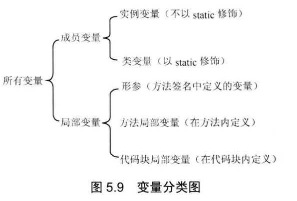

[toc]
# 面向对象(上)
Java是面向对象的程序设计语言， Java 语言提供了定义类、成员变量、方法等最基本的功能 。
## 类与对象
所有使用类定义的变量都是引用变量，它们将会引用到类的对象。也就是说，所有类是引用类型。
### 定义类
面向对象的程序设计过程中有两个重要概念:类(class)和对象(object，也被称为实例，instance),其中类是某一批对象的抽象，可以把类理解成某种概念。对象才是一个具体存在的实体，从这个意义上来看，日常所说的人，其实都是人的实例，而不是人类。

定义类语法格式
```bash
[修饰符] class 类名
{
    零个到多个构造器定义...
    零个到多个成员变量...
    零个到多个方法...
}
```
在上边的语法格式中
* 修饰符可以是`public`，`final`，`abstract`，或者完全省略这三个修饰符
* 类名命名规则遵循`大驼峰命名法`规则：每个单词首字母大写，其他字母全部小写，单词与单词之间不要使用任何分隔符。
    * 例如
    ```bash
    MyTest、HandleExcel、HandleRequests
    ```
#### 类的组成
一个类通常包含三中最常见的成员。
* 构造器
    * 构造器是一个类创建对象的根本途径，如果一个类没有构造器，这个类通常无法创建实例。
    * 因此，Java语言提供了一个功能：如果程序员没有为一个类编写构造器，则系统会为该类提供一个默认的构造器。一旦程序员为一个类提供了构造器，系统将不再为该类提供构造器。
* 成员变量：成员变量用于定义该类或该类的实例所包含的状态数据。
* 方法：方法则用于定义该类或该类的实例的行为特征或者功能实现。

需要注意的点
1. 类中的成员数量无限制。
2. 类中各成员之间的定义顺序没有要求，各成员之间可以互相调用。但是`static`修饰的成员不能访问没有`static`修饰的成员。
#### 成员变量
定义成员变量语法格式
```bash
[修饰符] 类型 成员变量名 [=默认值];
```
成员变量详细说明
* 修饰符
    * 可以省略
    * 可以是`public`，`protected`，`private`，`static`，`final`,其中`public`，`protected`，`private`三个最多只能出现一个，可以与`static`，`final`组合使用来修饰成员变量
* 类型
    * 不可省略，可以是基本数据类型和引用数据类型。
* 成员变量名
    * 遵循`小驼峰命名法`规则：第一个单词首字母小写，后面每个单词首字母大写，其他字母全部小写，单词与单词之间不要使用任何分隔符。
* 默认值
    * 定义成员变量还可以指定 个可边的默认值

#### 方法
定义方法语法格式
```bash
[修饰符] 方法返回值类型 方法名(形参列表)
{
    //由零条或多条可执行语句组成的方法体
}
```
方法详细说明
* 修饰符
    * 可以省略
    * 可以是`public`，`protected`，`private`，`static`，`final`,其中`public`，`protected`，`private`三个最多只能出现一个，可以与`static`，`final`组合使用来修饰方法
* 方法返回值类型
    * 返回值类型可以是基本数据类型和引用类型
    * 如果声明了方法返回值类型，方法体内必须提供一个`return`语句，返回一个变量或表达式。变量或者表达式的类型必须与此处声明的类型匹配。
    * 如果未声明方法返回值类型，必须使用void声明该方法没有返回值。
* 方法名
    * 方法名命名规则与成员变量命名规则一致。
* 形参列表
    * 形参列表用于定义该方法可以接受的参数
    * 格式：由零组或多组形参组成
        * 零组就是值该方法没有形参
        * 一组形参：`(数据类型 形参名)`
        * 多组形参：`(数据类型 形参名1, 数据类型 形参名2)`
    * 一旦定义方法时指定了形参列表，调用方法时必须传入对应的参数值(谁调用方法，谁负责为形参赋值)
* 方法体
    * 方法体里多条可执行性语句之间有严格的执行顺序，排在方法体前面的语句总是先执行，排在方法体后面的语句总是后执行。
#### `static`关键字
`static`的真正作用就是用于区分成员变量、方法、内部类、初始化块这四种成员到底属于类本身还是属于实例。

在类中定义的成员，`static`相当于一个标志，有`static`修饰的成员属于类本身，没有`static`修饰的成员属于该类的实例。
* 通常把`static`修饰的成员变量和方法也称为类变量、类方法。
* 不使用`static`修饰的普通方法、成员变量则属于该类的单个实例，而不属于该类。因此通常把不使用`static`修饰的成员变量和方法也称为实例变量、实例方法。
#### 构造器
构造器是一个特殊的方法，定义构造器的语法格式与定义方法的语法格式很像，定义构造器的语法格式如下:
```bash
[修饰符] 构造器名 (形参列表)
{
    //由零条到多条可执行性语句组成的构造器执行体
}
```
构造器详细说明
* 修饰符
    * 可以省略
    * 可以是`public`，`protected`，`private`其中之一
* 构造器名字：构造器名字必须与类名相同。
* 形参列表：和定义方法形参列表的格式完全相同。
使用构造器时需要注意的点
* 构造器既不能定义返回值类型，也不能使用`void`声明构造器没有返回值。
* 如果为构造器定义了返回值类型，或使用`void`声明构造器没有返回值，编译时不会出错，但`Java`会把这个所谓的构造器当成方法来处理——>它就不再是构造器。

构造器不是没有返回值吗，为什么不能用void来声明呢？
1. 这是Java语法的规定
2. 实际上，类的构造器是有返回值的。当使用new关键字来调用构造器时，构造器返回该类的实例，可以把这个类的实例当成构造器的返回值，因此构造器的返回值类型总是当前类，无需定义返回值类型。
3. 必须注意：不要在构造器里显式使用`return`来返回当前类的对象，因为构造器的返回值是隐式的。

#### 定义一个`Person`类
```java
public class Person{
    //定义两个成员变量
    public String name;
    public int age;
    //定义一个say方法
    public void say(String content){
        System.out.println(content);
    }
}
```
上边的Person类里没有手动定义构造器，系统自动为该类提供一个构造器，系统提供的构造器总是没有参数的。

#### Java中类的作用
* 定义变量
* 创建对象
* 调用类的类方法或访问类的类变量。
### 使用类
#### 对象的产生和使用
创建对象的根本途径是构造器，通过new关键字来调用某个类的构造器即可创建这个类的实例。

##### 创建对象
```bash
//使用Person类定义一个Person类型的变量
Person p;
//通过new关键字调用Person类的构造器，返回一个Person实例
//讲该Person实例赋值给p
p = new Person();
//上边代码可以简写成一行代码
Person p = new Person();
```
##### 使用对象
Java的对象大致有如下作用
* 访问对象的实例变量(也叫实例属性)
* 调用对象的方法

注意点
* 类或实例访问方法或成员变量的语法是:`类.类变量|方法`，或者`实例.实例变量|方法`
* `static`修饰的方法和成员变量，既可通过类来调用，也可通过实例来调用
* 没有使用`static`修饰的普通方法和成员变量，只可通过实例来调用
* 如果堆内存里的对象没有任何变量指向该对象，那么程序将无法再访问该对象，这个对象也就变了垃圾，Java的垃圾回收机制将回收该对象，释放该对象所占的内存区。
* 如果希望通知垃圾回收机制回收某个对象，只需要切断该对象的所有引用变量和它之间的关系即可，也就是把这些引用变量赋值为**`null`**。

代码示例

**`Person.java`**
```java
package com.abc.part4;

public class Person {
    //定义两个成员变量
    public String name;
    public int age;

    //定义一个say方法
    public void say(String content) {
        System.out.println(content);
    }

}
```
**`PersonTest.java`**
```java
package com.abc.part4;

public class PersonTest {
    public static void main(String[] args) {
        Person p = new Person();
        System.out.println("***************未对Person类的实例属性name，age进行赋值前***************");
        System.out.println(p.name);
        System.out.println(p.age);
        p.name = "小明";
        p.age = 21;
        System.out.println("***************对Person类的实例属性name，age进行赋值后***************");
        System.out.println(p.name);
        System.out.println(p.age);
        System.out.println("***************调用Person类的实例方法say***************");
        p.say("人生苦短,Let's Go!");
    }


}
```
运行`PersonTest.java`输出以下结果
```bash
***************未对Person类的实例属性name，age进行赋值前***************
null
0
***************对Person类的实例属性name，age进行赋值后***************
小明
21
***************调用Person类的实例方法say***************
人生苦短,Let's Go!
```
大部分时候，定义一个类就是为了重复创建该类的实例，同一个的多个实例具有相同的特征，而类则是定义了多个实例的共同特征。从某个角度来看，类定义的是多个实例的特征，因此类不是一种具体存在，实例才是具体存在 。完全可以这样说:你不是人这个类，我也不是人这个类，我们都只是人的实例。

#### 对象`this`的使用
Java中this关键字总是指向调用该方法的对象。this作为对象的默认引用有两种情形：
1. 构造器中引用该构造器正在初始化的对象。
2. 在方法中引用调用该方法的对象。

##### 在方法中引用调用该方法的对象
`this`关键宇最大地作用就是让类中一个方法，访问该类里的另一个方法或实例变量。

代码示例

**`Dog1.java`**
```java
package com.abc.part4;

public class Dog1 {
    public String dogName;

    public void jump() {
        System.out.println("Dog jump~");
    }

    public void run() {
        dogName = "小花花";
        Dog1 dog = new Dog1();
        dog.jump();//假设Dog run的前提是Dog jump
        System.out.println("Dog run~");
    }
}
```
**`Dog2.java`**
```java
package com.abc.part4;

public class Dog2 {
    public String dogName;

    public void jump() {
        System.out.println("Dog jump~");
    }

    public void run() {
        dogName = "小花花";
        this.jump();//假设Dog run的前提是Dog jump
        System.out.println("Dog run~");
    }
}
```
**`Dog3.java`**
```java
package com.abc.part4;

public class Dog3 {
    public String dogName;

    public void jump() {
        System.out.println("Dog jump~");
    }

    public void run() {
        dogName = "小花花";
        jump();//假设Dog run的前提是Dog jump
        System.out.println("Dog run~");
    }
}
```
**`DogTest.java`**
```java
package com.abc.part4;

public class DogTest {
    public static void main(String[] args) {
        System.out.println("*********Dog1*********");
        Dog1 d1 = new Dog1();
        // 调用Dog1里的run方法，创建两个Dog对象
        d1.run();
        /**
         * 这里产生了两个问题
         * 第一个问题：Dog1类中run()方法中调用jum()方法时是否一定需要一个Dog对象?
         * 第二个问题:是否一定需要重新创建一个Dog对象?
         * 第一个问题的答案是肯定的，因为没有使用static修饰的成员变量和方法都必须使用对象来调用 。
         * 第二个问题的答案是否定的，因为当程序调用run()法时，一定会提供一个Dog对象，这样就可以直接使用这个己经存在的Dog对象，而无须重新创建新Dog对象了.
         * 因此需要在run()方法中获得调用该方法的对象，通过this关键字就可以满足这个要求。
         *
         * this可以代表任何对象，当this出现在某个方法体中时，它所代表的对象是不确定的，但它的类型是确定的：它所代表的只能是当前类的实例，只有当这个方法被调用时，它所代表的对象才被确定下来：谁在调用这个方法，this就代表谁。
         * 因此将Dog1中run()方法中使用this关键字来调用jump()方法会更合适些。
         * 代码如Dog2所示
         */
        System.out.println("*********Dog2*********");
        Dog2 d2 = new Dog2();
        //调用Dog1里的run方法，只创建了一个Dog对象
        d2.run();
        /**
         * this关键字可以省略
         * 代码如Dog3所示
         */
        System.out.println("*********Dog3*********");
        Dog3 d3 = new Dog3();
        d3.run();


    }
}
```
对于static修饰的方法而言，可以使用类来直接调用该方法，static修饰的方法中不能使用this引用。
* 由于static修饰的方法不能使用this引用，所以static修饰的方法不能访问不使用static修饰的普通成员，因此Java语法规定:静态成员(包括方法、成员变量)不能直接访问非静态成员(包括方法、成员变量)。

静态方法直接访问非静态方法时引发错误代码示例
```java
package com.abc.part4;

public class StaticAccessNonStatic {
    public void say1(){
        System.out.println("一个简单的非静态方法");
    }
    public static void say2(){
        System.out.println("一个简单的静态方法");
    }
    public static void main(String[] args){
        //执行程序编译时会报错：Error:(11, 9) java: 无法从静态上下文中引用非静态 方法 say1()。
        // 因为say1()是属于示例的方法不是属于类的方法。因此必须需要使用对象来调用该方法。
        //say1();
        /**
         * 在上面的main()方法中直接调用say1()方法时，系统相当于使用this作为该方法的调用者，
         * 而main()方法是static修饰的方法，static修饰的方法属于类，而不属于对象，因此调用static修饰的方法的主调总是类本身.
         */
        //如果确实需要在静态方法里调用非静态方法。可以创建类对象，使用类对象来调用非静态方法。
        new StaticAccessNonStatic().say1();//输出：一个简单的非静态方法
        //执行不会报错
        say2();//输出：一个简单的静态方法
    }
}
```
大部分时候，普通方法访问其他方法、成员变量时无须使用**`this`**前缀 ，但如果方法里有个局部变量和成员变量同名，但程序又需要在该方法里访问这个被覆盖的成员变量，则必须使用**`this1**前缀。
##### 构造器中引用该构造器正在初始化的对象(简单来说就是在构造器中使用this关键字)
`this`引用也可以用于构造器中作为默认引用，由于构造器是直接使用`new`关键宇来调用，而不是使用对象来调用的，所以`this`在构造器中代表该构造器正在初始化的对象。

代码示例
```java
package com.abc.part4;

public class ThisInConstructor {
    public String name;

    //定义一个构造器
    public ThisInConstructor() {
        //在构造器里定义一个name变量
        String name;
        //使用this代表该构造器正在初始化的对象
        //下面的代码将会把该构造器正在初始化的对象的name成员变量设置成`小花花`
        this.name = "小花花";
    }

    public static void main(String[] args) {
        System.out.println(new ThisInConstructor().name);//小花花
    }
}
```
程序输出
```bash
小花花
```
## 方法详解
方法是类或对象的行为特征的抽象，方法是类或对象最重要的组成部分。

Java里的方法不能独立存在，所有的方法都必须定义在类里。方法在逻辑上要么属于类，要么属于对象。

### Java里方法的所属性
* 方法不能独立定义，方法只能在类里边定义
* 从逻辑意义上来讲，方法要么属于该类本身，要么属于该类的一个对象
* 永远不能独立执行方法，执行方法必须使用类或对象作为调用者。

### 方法调用
1. 使用`static`修饰的方法，可以使用`类`或`类对象`来调用。
2. 不使用`static`修饰的方法，只能使用类对象来调用。

### 方法参数传递机制
Java里方法参数传递方式只有一种：`值传递`，所谓值传递，就是将`实际参数值的副本(复制品)`传入方法内，而参数本身不会受到任何影响。

基本类型的值传递代码示例
```java
package com.abc.part4;

/**
 * @Auther: ABC
 * @Date: 2020/5/3 12:27
 * @Description: 验证值传递就是将`实际参数值的副本(复制品)`传入方法内，而参数本身不会受到任何影响。
 */
public class PrimitiveTransferTest {
    public static void swap(int a, int b) {
        int tmp = a;
        a = b;
        b = tmp;
        System.out.println("a和b交换后的值为：" + "a = " + a + ", b = " + b);
    }

    public static void main(String[] args) {
        /**
         * 当程序执行swap()方法时,系统进入swap()方法，并将main()法中的a,b变量作为参数值传入swap()方法,
         * 传入swap()方法的只是a,b的副本，而不是a,b本身。
         */
        int a = 3;
        int b = 4;
        swap(3, 4);
        System.out.println("交换结束后的a, b值为：" + "a = " + a + ", b = " + b);
    }
    /**
     * 输出：
     * a和b交换后的值为：a = 4, b = 3
     * 交换结束后的a, b值为：a = 3, b = 4
     */
}
```
引用类型的值传递代码示例
```java
package com.abc.part4;

/**
 * @Auther: ABC
 * @Date: 2020/5/3 12:56
 * @Description: 引用类型的值传递代码示例：验证值传递就是将`实际参数值的副本(复制品)`传入方法内，而参数本身不会受到任何影响。
 */
public class ReferenceTransferTest {
    public static void swap(String a, String b) {
        String tmp = a;
        a = b;
        b = tmp;
        System.out.println("a和b交换后的值为：" + "a = " + a + ", b = " + b);
    }

    public static void main(String[] args) {
        String a = "小花花";
        String b = "小亮亮";
        swap(a, b);
        System.out.println("交换结束后的a, b值为：" + "a = " + a + ", b = " + b);
        /**
         * 输出：
         * a和b交换后的值为：a = 小亮亮, b = 小花花
         * 交换结束后的a, b值为：a = 小花花, b = 小亮亮
         */

    }
}

```
### 值传递的实质
当系统开始执行方法时，系统为形参执行初始化，就是把实参变量的值赋给方法的形参变量，方法里操作的并不是实际的实参变量。

### 形参个数可变的方法
如果在定义方法时，在最后一个形参的类型后增加三点(...)，则表明该形参可以接受多个参数值，多个参数值被当成`数组`传入。

代码示例
```java
package com.abc.part4;

import java.util.Arrays;

/**
 * @Auther: ABC
 * @Date: 2020/5/3 21:48
 * @Description:
 */
public class Varargs {
    public static void test(int a, String... books) {
        System.out.println("一共" + a + "本书, " + Arrays.toString(books));
        System.out.println("分别是以下这些书：");
        for (String book : books){
            System.out.println(book);
        }
    }

    public static void main(String[] args) {
        test(3, "疯狂Java讲义", "疯狂Python讲义", "Java核心技术卷");
        /**
         * 输出：
         * 一共3本书, [疯狂Java讲义, 疯狂Python讲义, Java核心技术卷]
         * 分别是以下这些书：
         * 疯狂Java讲义
         * 疯狂Python讲义
         * Java核心技术卷
         */
    }
}
```
需要注意的点
* 数组形式的形参可以处于形参列表的任意位置，但个数可变的形参(如`String... books`)只能处于形参列表的最后。
* 一个方法中最多只能有一个`个数可变的形参`。
* 个数可变的形参本质就是一个数组类型的形参
### 递归方法
一个方法体内调用它自身，被称为方法递归。方法递归包含了一种隐式的循环，它会重复执行某段代码，但这种重复执行无须循环控制。

递归方法实现`计算数字阶乘`和`斐波拉切数列`，代码示例
```java
package com.abc.part4;

import java.util.ArrayList;
import java.util.List;
import java.util.Scanner;

/**
 * @Auther: ABC
 * @Date: 2020/5/3 22:29
 * @Description:
 */
public class Recursive {
    /**
     * 计算一个整数的阶乘,如果用字母n来代表一个整数，阶乘代表着所有`小于或等于n`且大于0的整数的乘积。
     * 阶乘通常简写成 n!
     * 例如: 5! = 1 * 2 * 3 * 4 * 5 = 120
     *
     * @param n
     * @return 计算结果
     */
    public static int fn(int n) {
        if (n == 1) {
            return 1;
        } else {
            //方法中调用它自身,就是方法递归
            return n * fn(n - 1);
        }
    }

    /**
     * 递归函数实现斐波那契数列
     * 斐波那契数列：[1,1,2,3,5,8,13,21,34....],第一个数是1，后面的数等于前面两个数相加的结果
     * 打印1-50内的斐波拉切数列
     *
     * @param m
     * @return 计算结果
     */
    public static int fn1(int m) {
        if (m == 1 || m == 2) {
            return 1;
        } else {
            return fn1(m - 1) + fn1(m - 2);
        }
    }


    public static void main(String[] args) {
        int result = fn(5);
        System.out.println("5! = " + result);//5! = 120

        Scanner scanner = new Scanner(System.in);
        System.out.println("请输入需要打印斐波拉契数列中的数字个数：");
        int numCount = scanner.nextInt();
        List<Integer> list=new ArrayList<Integer>();
        for (int i = 1; i <= numCount; i++){
            list.add(fn1(i));
        }
        System.out.print("斐波拉契数列中前" + numCount + "个数字为：" + list);
        /**
         * 输出：
         * 5! = 120
         * 请输入需要打印斐波拉契数列中的数字个数：
         * 10
         * 斐波拉契数列中前10个数字为：[1, 1, 2, 3, 5, 8, 13, 21, 34, 55]
         */
    }
}
```
### 方法重载
Java允许同一个类里定义多个同名方法，只要形参列表不同就行。如果同一个类中包含了两个或两个以上方法的方法名相同，但形参列表不同，则被称为方法重载。

确定一个方法的三个要素
* 调用者，也就是方法的所有者，可以是类，也可以是对象。
* 方法名。
* 形参列表，当调用方法时，系统会根据传入的实参列表进行匹配。

方法重载的要求：二同一不同
* 同一个类中方法名相同，参数列表不同。方法返回值类型、修饰符等，与方法重载没有任何关系。
```java
package com.abc.part4;

public class OverLoad {
    /*
    方法重载,同一个类中，方法名相同，形参列表不同。
     */
    public void test(String name, int age) {
        System.out.println("我的名字是:" + name + ", 我的年龄是:" + age);
    }

    public void test(String name, char gender) {
        System.out.println("我的名字是:" + name + ", 我的性别是:" + gender);
    }

    public static void main(String[] args) {
        OverLoad overLoad = new OverLoad();
        overLoad.test("小花花", 21);
        overLoad.test("小花花", '女');
        /**
         * 输出：
         * 我的名字是:小花花, 我的年龄是:21
         * 我的名字是:小花花, 我的性别是:女
         */
    }
}
```
### 成员变量和局部变量
在Java语言中，根据定义变量位置的不同，可以将变量分成两大类：成员变量和局部变量。
* 成员变量
    * 成员变量指的是在类里定义的变量。
* 局部变量
    * 局部变量指的是在方法里定义的变量。

变量分类图

#### 成员变量
成员变量被分为类变量和实例变量两种，定义成员变量时`没有static`修饰的就是实例变量，`有static`修饰的就是类变量。
* 类变量从该类的准备阶段起开始存在，直到系统完全销毁这个类，类变量的作用域与这个类的生存范围相同。
* 实例变量则从该类的实例被创建起开始存在，直到系统完全销毁这个实例，实例变量的作用域与对应实例的生存范围相同。

正是基于以上的原因，可以把类变量和实例变量统称为成员变量。
* 类变量可以理解为类成员变量，它作为类本身的一个成员，与类本身共存亡;
* 实例变量则可理解为实例成员变量，它作为实例的一个成员，与实例共存亡。

只要类存在，程序就可以访问该类的类变量。在程序中访问类变量通过如下语法：
```bash
类.类变量
```
只要实例存在，程序就可以访问该实例的实例变量。在程序中访问实例变量通过如下语法：
```bash
实例.实例变量
```
当然，类变量也可以让该类的实例来访问。通过实例来访问类变量的语法如下:
```bash
实例.类变量
```
代码示例

**`Person1.java`**
```java
package com.abc.part4;

public class Person1 {
    public String name;
    public static int eyeNum;
}
```
**`Person1Test.java`**
```java
package com.abc.part4;

public class Person1Test {
    public static void main(String[] args) {
        Person1 person1 = new Person1();
        Person1 person2 = new Person1();
        System.out.println("1)我的名字是：" + person1.name + ", 我有" + Person1.eyeNum + "只眼睛。");
        //通过Person1类访问类变量
        Person1.eyeNum = 1;
        System.out.println("2)我的名字是：" + person1.name + ", 我有" + Person1.eyeNum + "只眼睛。");
        //通过Person1类示例访问类变量
        person1.eyeNum = 2;
        System.out.println("3)我的名字是：" + person1.name + ", 我有" + Person1.eyeNum + "只眼睛。");
        //通过Person1类示例person1访问实例变量
        person1.name = "小花花";
        System.out.println("4)我的名字是：" + person1.name + ", 我有" + Person1.eyeNum + "只眼睛。");
        ////通过Person1类示例person2访问类变量eyeNum，访问到的是修改后的eyeNum
        System.out.println("5)我的名字是：" + person2.name + ", 我有" + Person1.eyeNum + "只眼睛。");
        /**
         * 程序输出：
         * 1)我的名字是：null, 我有0只眼睛。
         * 2)我的名字是：null, 我有1只眼睛。
         * 3)我的名字是：null, 我有2只眼睛。
         * 4)我的名字是：小花花, 我有2只眼睛。
         * 5)我的名字是：null, 我有2只眼睛。
         */
    }
}
```
从上面程序运行结果不难发现，类变量的作用域比实例变量的作用域更大。实例变量随实例的存在而存在，而类变量则随类的存在而存在。实例也可访问类变量，同一个类的所有实例访问类变量时，实际上访问的是该类本身的同一个变量，也就是说，访问了同一片内存区。

如前面提到的，Java允许通过实例来访问`static`修饰的`成员变量`本身就是一个错误, 因此以后看到通过实例来访问成员变量的情形，都可以将它替换成通过类本身来访问`static`成员变量的情形，这样程序的可读性、明确性都会大大提高。

#### 局部变量
局部变量根据定义形式的不同，又可以被分为如下三种
* 形参：在定义方法时定义的变量，形参的作用域在整个方法内有效。
    * 形参的作用域是整个方法体内有效，而且形参也无须**`显式初始化`**，形参的初始化在调用该方法时由系统完成，形参的值由方法的调用者负责指定。
    * 当通过类或对象调用某个方法时，系统会在该方法枝区内为所有的形参分配内存空间，并将实参的值赋给对应的形参，这就完成了形参的初始化。
    ```java
    package com.abc.part4;
    
    public class VariableOverrideTest {
        //创建两个成员变量
        private String name = "小花花";//实例变量
        private static int age = 21;//；类变量
    
        public void info(char gender) {
            String name = "大花花";
            System.out.println("我叫" + name + ", 性别是：" + gender);//我叫大花花, 性别是：女
            //使用this来调用实例变量
            System.out.println(this.name);//小花花
    
        }
    
        public static void main(String[] args) {
            //创建一个局部变量
            int age = 22;
            System.out.println("我的年龄是" + age);//我的年龄是22
            System.out.println("小花花的年龄是" + VariableOverrideTest.age);//小花花的年龄是21
            new VariableOverrideTest().info('女');
        }
    }
    ```
    从上面代码可以清楚地看出局部变量覆盖成员变量时，依然可以在方法中显式指定类名和使用`this(只能用来调用实例变量，不能调用类变量)`作为调用者来访问被覆盖的成员变量。这使得编程更加自由，不过大部分时候还是应该尽量避免这种局部变量和成员变量同名的情形。
* 方法局部变量：在方法体内定义的局部变量，作用域是从定义该变量的地方开始生效，到该方法结束时失效。
    ```java
    package com.abc.part4;
    
    public class MethodLocalVariableTest {
        public static void main(String[] args) {
            int b;//定义一个方法局部变量b
            //System.out.println("方法局部变量的值为：" + b);//会报错，因为方法局部变量还为进行初始化。
            b = 7;//为方法局部变量进行赋值，也就是进行初始化。
            System.out.println("方法局部变量的值为：" + b);//方法局部变量的值为：7
    
    
        }
    }
    ```
* 代码块局部变量：在代码块中定义的局部变量，作用域是从定义该变量的地方开始生效，到该代码块结束时失效。
    ```java
    package com.abc.part4;
    
    public class BlockTest {
        public static void main(String[] args) {
            {
                int a;//定义一个代码块局部变量a
                //System.out.println("代码块局部变量a的值为：" + a);//会报错，因为未对代码块局部变量a做初始化，
                a = 5;
                System.out.println("代码块局部变量a的值为：" + a);//初始化局部变量a后才可以正常进行编译和输出：代码块局部变量a的值为：5
            }
            //System.out.println(a);//会报错，代码块外是访问不到局部变量a的。
        }
    
    }
    ```
    从上边程序代码可以看出来，程序执行完代码块后，代码块局部变量a立即被销毁。代码块局部变量a只能在代码块中可以访问得到，在代码块是访问不到的。

#### 成员变量与局部变量比较
**`ScopeTest1.java`**
```java
package com.abc.part4;

public class ScopeTest1 {
    //定义一个类成员变量作为循环变量
    static int i;

    public static void main(String[] args) {
        for (i = 1; i <= 10; i++) {
            System.out.println(i);
        }
    }
}
```
**`ScopeTest2.java`**
```java
package com.abc.part4;

public class ScopeTest2 {
    public static void main(String[] args) {
        //定义一个方法局部变量作为循环变量
        int i;
        for (i = 1; i <= 10; i++) {
            System.out.println(i);
        }
    }
}
```
**`ScopeTest3.java`**
```java
package com.abc.part4;

public class ScopeTest3 {
    public static void main(String[] args) {
        //定义一个代码块局部变量作为循环变量
        for (int i = 1; i <= 10; i++) {
            System.out.println(i);
        }
    }
}
```
以上三个程序执行结果完全相同，但是第三种最符合软件开发规范。对于一个循环变量而言，只需要它在循环体内有效即可，因此这个变量需要在代码块中进行定义，从而保证这个变量的作用域只在该代码块中。该局部变量占用的内存更小，程序性能更健壮。

## 面向对象三大特征之封装
封装(Encapsulation)是面向对象的三大特征之一(另外两个是继承和多态)，它指的是将对象的状态信息隐藏在对象内部，不允许外部程序直接访问对象内部信息，而是通过该类所提供的方法来实现对内部信息的操作和访问。

对于一个类或对象实现良好封装的好处
* 隐藏类的实现细节。
* 让使用者只能通过事先预定的方法来访问数据，从而可以在该方法里加入控制逻辑，限制对成员变量的不合理访问。
* 可进行数据检查，从而有利于保证对象信息的完整性。
* 便于修改，提高代码的可维护性。

为了实现良好的封装， 需要从两个方面考虑
* 将对象的成员变量和实现细节隐藏起来，不允许外部直接访问。
* 把方法暴露出来，让方法来控制对这些成员变量进行安全的访问和操作。
因此，封装实际上有两个方面的含义:把该隐藏的隐藏起来，把该暴露的暴露出来，这两个方面都需要通过使用`Java`提供的`访问控制符`来实现。
### 使用访问控制符
Java提供的4个访问控制符`public`，`private`，`protected`和`default`(不加任何访问控制符的访问控制级别)

Java访问控制级别由小到大如下图所示

图5.14中的4个访问控制级别中的`default`并没有对应的访问控制符，当不使用任何访问控制符来修饰类或类成员时，系统默认使用该访问控制级别。

#### 访问控制符详解
* `private`:**当前类访问权限**
    * 如果类里的一个成员(包括成员变量、方法和构造器等)使用`private`访问控制符来修饰，则这个成员只能在当前类的内部被访问。
    * `private`访问控制符比较适合用来修饰成员变量，使用`private`来修饰成员变量可以把成员变量隐藏在该类的内部。
* `default`:**包访问权限**
    * 如果类里的一个成员(包括成员变量、方法和构造器等)或者一个外部类不使用任何访问控制符修饰，就称它是`包访问权限`的，`default`访问控制的成员或外部类可以被相同包下的其他类访问。
* `protected`:**子类访问权限**
    * 如果一个成员(包括成员变量、方法和构造器等)使用`protected`访问控制符修饰，那么这个成员既可以被同一个包中的其他类访问，也可以被不同包中的子类访问。在通常情况下，如果使用`protected`来修饰一个方法，通常是希望其子类来重写这个方法。
* `public`:**公共访问权限**
    * 如果一个成员(包括成员变量、方法和构造器等)或者一个外部类使用`public`访问控制符修饰。那么这个成员或外部类就可以被所有类访问，不管访问类和被访问类是否处于同一个包中，是否具有父子继承关系。

访问控制级别关系如下表所示


#### 访问修饰符对于局部变量
访问控制符用于控制一个类的成员是否可以被其他类访问，对于局部变量而言，其作用域就是它所在的方法，所以局部变量不能使用访问修饰符来控制访问权限。
#### 访问修饰符对于外部类
* 外部类只能使用两种访问修饰符：`public`和`default`(默认)，不能使用`private`和`protected`来修饰。因为外部类没有处于任何类的内部，也就没有其所在类的内部、所在类的子类两个范围，因此`private`和`protected`访问控制符对`外部类`**没有意义**。
* 使用`public`修饰符来修饰外部类：该外部类可以被所有类使用，如声明变量，创建实例。
* 使用`default`(默认)修饰符来修饰外部类：该外部类只能被同一个包中的其他类使用。

##### 知识点
* 如果一个`Java`源文件里定义的所有类都没有使用`public`修饰，则这个`Java`源文件的文件名可以是一切合法的文件名;
* 但如果`Java`源文件里定义了一个`public`修饰的类，则这个源文件的文件名必须与`public`修饰的类的类名相同。

#### 封装代码实例
通过使用合理的访问控制符来定义一个Person2类，这个Person2类实现了良好的封装。

**`Person2.java`**
```java
package com.abc.part4;

/**
 * 如果一个Java类的每个实例变量都被使用private修饰，并为每个实例变量都提供了public修饰setter和getter方法，那么这个类就是一个符合JavaBean规范的类
 * JavaBean总是一个封装良好的类。
 */
public class Person2 {
    private String name;
    private int age;

    public void setName(String name) {
        if (name.length() >= 2 && name.length() <= 6) {
            this.name = name;
        } else {
            System.out.println("设置的名字长度过长或过短!");
        }
    }

    public String getName() {
        return this.name;
    }

    public void setAge(int age) {
        if (age >= 0 && age <= 100) {
            this.age = age;
        } else {
            System.out.println("设置的age不能小于0岁或大于100岁!");
        }
    }

    public int getAge() {
//        return this.age;
        return age;//this关键字可以省略

    }
}
```
定义了上面的`Person2`类之后,该类的`name`和`age`两个成员变量只有在`Person2`类内才可以操作和访问，`Person2`类之外只能通过各自对应的`setter`和`getter`方法来操作和访问它们。

**`Person2Test.java`**
```java
package com.abc.part4;

public class Person2Test {

    public static void main(String[] args) {
        Person2 person2 = new Person2();
        person2.setName("小花花");
        person2.setAge(21);
        System.out.println("我叫" + person2.getName() + ", 今年" + person2.getAge() + "岁了!");//我叫小花花, 今年21岁了!
    }

}
```
例如，某个类里包含了一个名为`abc`的实例变量，则其对应的`setter`和`getter`方法名应为`setAbc()`和`getAbc()`(即将原实例变量名的首字母大写，并在前面分别增加`set`和`get`动词，就变成`setter`和`getter`方法名)。

#### Java 类里实例变量的`setter`和`getter`方法的意义：
* 如果一个`Java`类的每个实例变量都被使用`private`修饰，并为每个实例变量都提供了`public`修饰`setter`和`getter`方法，那么这个类就是一个符合`JavaBean`规范的类。`JavaBean`总是一个封装良好的类。

#### 访问控制符使用的基本原则
1. 类里的绝大部分成员变量都应该使用`private`修饰，只有一些`static`修饰的、类似全局变量的成员变量，才可能考虑使用`public`修饰。除此之外，有些方法只用于辅助实现该类的其他方法，这些方法被称为工具方法，工具方法也应该使用`private`修饰。
2. 如果某个类主要用做其他类的父类，该类里包含的大部分方法可能仅希望被其子类重写，而不想被外界直接调用，则应该使用`protected`修饰这些方法。
3. 希望暴露出来给其他类自由调用的方法应该使用`public`修饰。因此，类的构造器通过使用`public`修饰，从而允许在其他地方创建该类的实例。因为外部类通常都希望被其他类自由使用，所以大部分外部类都使用`public`修饰。

#### 总结
* 一个类常常就是一个小的模块，应该只让这个模块公开必须让外界知道的内容，而隐藏其他一切内容。
* 进行程序设计时，应尽量避免一个模块直接操作和访问另一个模块的数据，模块设计追求高内聚(尽可能把模块的内部数据、功能实现细节隐藏在模块内部独立完成，不允许外部直接干预)、低耦合(仅暴露少量的方法给外部使用)。
* 正如日常常见的内存条，内存条里的数据及其实现细节被完全隐藏在内存条里面，外部设备(如主机板)只能通过内存条的全手指(提供一些方法供外部调用)来和内存条进行交互。

## `package`、`import`和`import static`
Java引入了包(package)机制，提供了类的多层命名空间，用于解决类的命名冲突、类文件管理等问题。

Java允许将一组功能相关的类放在同一个`package`下，从而组成逻辑上的类库单元。

如果希望把一个类放在指定的包结构下，应该在`Java`源程序的第一个非注释行放置如下格式的代码:
```java
package packageName;
```
一旦在`Java`源文件中使用了这个`package`语句，就意味着该源文件里定义的`所有类`都属于`这个包`。位于包中的`每个类`的`完整类名`都应该是`包名和类名的组合`，如果其他人需要使用`该包下的类`，也应该使用`包名加类名的组合`。

### 构成Java包机制的两大要素
* 源文件里使用`package`语句指定包名。
* `class`文件必须放在对应的路径下。


### 包名命名规则
* Java语法只要求包名是`有效的标识符`即可，但从可读性规范角度来看，包名应该全部是小写字母，而且应该由一个或多个有意义的单词连缀而成。
* `Oracle`建议使用`公司Internet域名`**倒写**来作为包名 ，例如公司的Internet域名是`crazyit.org`，则该公司项目的所有类都建议放在`org.crazyit`包及其子包下。
* `package`语句必须作为源文件的第一条非注释性语句，一个源文件只能指定一个包，即只能包含一条`package`语句，该源文件中可以定义多个类，则这些类将全部位于该包下。

### import关键字
`import`语句可以简化编程，可以导入指定包下某个类或全部类。
* 同一个包下的类可以自由访问。无需使用`import`关键字导入该类(包名+类名组合)
* 不同包下的类互相调用时需要使用`import`关键字
    * `import`可以向某个`Java`文件中导入指定包层次下某个类或全部类。
    * `import`语句应该在`package`语句(如果有的话)之后，类定义之前。
    * 一个Java源文件只能包含一个`package`语句，但可以包含多个`import`语句。多个`import`语句用于导入多个包层次下的类。
* `import`语句导入语法
    * 导入单个类(一般类名与源文件名(也就是xxx.java)都是一致的)
        ```java
        
        ```
    * `import`导入指定包下的全部类
        ```java
        //*只代表part_three包下的所有类，不代表包(比如part_three包下的子包)
        
        ```
* 一旦在`Java`源文件中使用`import`语句来导入指定类，在该源文件中使用这些类时就可以省略包前缀，不再需要使用类全名。
* 极少数极端情况下不能使用`import`语句，只能在源代码中使用类全名。

`Java`默认为所有源文件导入`java.lang`包下的所有类，因此前面在`Java`中使用`String`，`System`类时都无须使用`import`语句来导入这些类。但对于前面介绍`数组`时提到的`Arrays`类位于`java.util`包下，则必须使用`import`语句来导入该类。

### 静态导入
JDK1.5后增加了一种静态导入(使用`import static`语句)的语法，它用于导入指定类的某个静态成员变量、方法或全部的静态成员变量、方法。
* 
* 导入指定类的`单个静态成员变量/方法`语法
    ```java
    //PI是java.lang.Math类的静态成员变量(类变量使用static修饰)，表示π常量。
    import static java.lang.Math.PI;
    ```
* 导入指定类的`全部静态成员变量/方法`语法
    ```java
    //导入java.lang.System类的全部静态成员变量和方法
    import java.lang.System.*;
    ```

代码示例
```java
package com.abc.part4;

//PI是java.lang.Math类的静态成员变量(类变量使用static修饰)，表示π常量。
import static java.lang.Math.PI;

import static java.lang.Math.sqrt;
import static java.lang.System.*;


/**
 * @author mi
 */
public class Person2Test {

    public static void main(String[] args) {
        /**
         * out是java.lang.System类的静态成员变量，代表标准输出。
         * PI是java.lang.Math类的静态成员变量，代表π常量
         */
        //输出：3.141592653589793
        out.println(PI);
        //直接调用Math类的sqrt静态方法
        //输出：16.0
        out.println(sqrt(256));
    }

}
```

### 一句话总结`import`和`import static`的作用
* Java源文件中使用`import`可以在写代码时省略写包名；使用`import static`可以在写代码时省略写类名。
* `import`语句和`import static`语句都是用于减少程序中代码编写量的。

### Java中常用的包

Java的核心类都放在`Java`包以及其子包下，`Java`扩展的许多类都放在`Javax`包以及其子包下。
1. `java.lang`: 这个包下包含了`Java`语言的核心类，如`String`、`Math`、`System`和`Thread`类等，使用这个包下的类无须使用`import`语句导入，系统会自动导入这个包下的所有类。
2. `java.util`: 这个包下包含了`Java`的大量`工具类/接口`和`集合框架类/接口`，例如`Arrays`和`List`、`Set`等。
3. `java.net`: 这个包下包含了一些`Java网络编程`相关的类/接口。
4. `java.io`: 这个包下包含了一些`Java输入/输出编程`相关的类/接口。
5. `java.text`: 这个包下包含了一些`Java格式化`相关的类。
6. `java.sql`: 这个包下包含了Java进行`JDBC数据库编程`的相关类/接口。
7. `java.awt`: 这个包下包含了`抽象窗口工具集(Abstract Window Toolkits)`的相关类/接口，这些类主要用于`构建图形用户界面(GUI)程序`。
8. `java.swing`: 这个包下包含了`Swing图形用户界面编程`的相关类/接口，这些类可用于构建平台无关的GUI程序。

## 深入构造器
### 构造器简介及用途
* 构造器是一个特殊的方法，这个特殊方法用于创建实例对象时执行初始化。
* 构造器是创建对象的重要途径(即使使用工厂模式、反射等方式创建对象，其实质依然是依赖于构造器)。因此，Java类必须包含一个或一个以上的构造器。
### 使用构造器进行初始化
1. 当创建一个类的实例对象时，系统为这个对象的实例变量进行默认初始化。
    * 数值类型的实例变量初始化默认值为`0`
    * `boolean`类型的实例变量初始化默认值是`false`
    * 引用类型的实例变量初始化默认值是`null`
2. 如果想改变默认初始化值，则需要通过构造器让系统创建对象时就为该对象的实例变量显式指定初始值。
    * 如果程序员没有为Java类提供任何构造器，则系统会为这个类提供一个无参数的构造器，这个构造器的执行体为空，不做任何事情。
    * 一旦程序员提供了自定义的构造器，系统就不再提供默认的构造器。代码示例
        ```java
        package com.abc.part4;
        
        /**
         * 构造器初始化demo
         *
         * @author mi
         */
        public class ConstructorInitialization {
            private String name;
            private int age;
            private char gender;
        
            /**
             * 创建一个自定义的构造器
             *
             * @param name   名字
             * @param age    年龄
             * @param gender 性别
             */
            public ConstructorInitialization(String name, int age, char gender) {
                //this代表它进行初始化的对象，分别将构造器形参中的name，age，gender传给ConstructorInitialization类中的实例变量：name，age，gender
                this.name = name;
                this.age = age;
                this.gender = gender;
            }
        
            public static void main(String[] args) {
                //使用自定义的构造器来创建对象，初始化类实例对象时需要传入三个参数name，age，gender分别对应构造器中的name，age，gender。
                ConstructorInitialization ci = new ConstructorInitialization("小花花", 21, '女');
                // 初始化ConstructorInitialization类的实例对象时为ConstructorInitialization类的实例变量显式指定默认值：name="小花花",age=21,gender='女'
                // 我的名字叫小花花, 我今年21岁了, 我的性别是女。
                System.out.println("我的名字叫" + ci.name + ", 我今年" + ci.age + "岁了, 我的性别是" + ci.gender + "。");
            }
        }
        ```
### 构造器重载
同一个类里具有多个构造器，多个构造器的形参列表不同，即被称为构造器重载。

构造器重载允许Java类里包含多个初始化逻辑，从而允许使用不同的构造器来初始化Java对象。
#### 构造器重载的条件
1. 同一个类里构造器名字都相同，形参列表不相同。
2. 因为构造器一定与类名相同，所以所有的构造器名字也都必须相同。
#### 代码示例
```java
package com.abc.part4;

/**
 * @author mi
 */
public class ConstructorOverload {
    private String name;
    private int age;

    /**
     * 手动定义一个无参构造器
     */
    public ConstructorOverload() {

    }

    /**
     * 定义一个有参构造器
     *
     * @param name 名字
     * @param age  年龄
     */
    public ConstructorOverload(String name, int age) {
        this.name = name;
        this.age = age;
    }

    public static void main(String[] args) {
        ConstructorOverload co = new ConstructorOverload();
        //我叫null, 我的年龄是0。
        System.out.println("我叫" + co.name + ", 我的年龄是" + co.age + "。");
        ConstructorOverload co1 = new ConstructorOverload("小花花", 21);
        //我叫小花花, 我的年龄是21。
        System.out.println("我叫" + co1.name + ", 我的年龄是" + co1.age + "。");
        
    }
}
```
上面的`ConstructorOverload`类提供了两个重载的构造器,两个构造器的名字相同，但形参列表不同。系统通过`new`调用构造器时，系统将根据传入的实参列表来决定调用哪个构造器。

还有一种情况，如果系统中包含了多个构造器，其中一个构造器的执行体里完全包含另一个构造器的执行体。如下图所示

对于这种完全包含的情况
* 如果是两个方法之间存在这种关系，则可在方法B中调用方法A。
* 但是构造器不能直接被调用，构造器必须使用`new`关键字来调用。但一旦使用`new`关键字来调用构造器，将会导致系统重新创建一个对象。

为了在构造器B中调用构造器A中的初始化代码，又不会重新创建一个`Java`对象，可以**使用`this`关键宇来调用相应的构造器**。
#### 代码示例
```java
package com.abc.part4;

/**
 * @author mi
 */
public class Apple {
    private String name;
    private String color;
    private double weight;

    /**
     * 手动定义一个无参构造器
     */
    public Apple() {

    }

    /**
     * 两个形参的构造器
     *
     * @param name  名字
     * @param color 颜色
     */
    public Apple(String name, String color) {
        this.name = name;
        this.color = color;
    }

    /**
     * 三个形参的构造器
     *
     * @param name   名字
     * @param color  颜色
     * @param weight 重量
     */
    public Apple(String name, String color, double weight) {
        //通过this关键字来调用另一个重载的构造器的初始化代码
        this(name, color);
        //下面this关键字引用该构造器正在初始化的Java对象。
        this.weight = weight;
    }

    public static void main(String[] args) {
        Apple apple = new Apple("青苹果", "青绿色", 0.3);
        //我有一个青苹果, 颜色是青绿色, 重量是0.3kg。
        System.out.println("我有一个" + apple.name + ", 颜色是" + apple.color + ", 重量是" + apple.weight + "kg。");
    }
}
```
* 使用`this`调用`另一个重载的构造器`只能在`构造器`中使用，而且必须作为`构造器执行体的第一条语句`。
* 使用`this`调用`重载的构造器`时，系统会根据`this`后括号里的实参来调用`形参列表与之对应的构造器`。

### 为什么要用`this`来调用另一个重载的构造器?
为了实现代码复用，尽量避免相同的代码重复出现，充分复用每一段代码，既可以让程序代码更加简洁，也可以降低软件的维护成本。

## 类的继承
继承是面向对象的三大特征之一，也是实现软件复用的重要手段。`Java`的继承具有单继承的特点，每个子类只有一个直接父类。
### 继承的特点
Java的继承通过`extends`关键字来实现，实现继承的类被称为`子类`，被继承的类被称为`父类`，有的也称其为`基类`，`超类`。
#### 子类继承父类的语法
```bash
修饰符 class SubClass extends SuperClass
{
    //子类的代码块    
}
```
* `Java`中`extends`作为继承的关键宇，`extends`关键字在英文中是`扩展`，而不是`继承`。这个关键字很体现了`子类`和`父类`的关系:`子类是对父类的扩展，子类是一种特殊的父类。`
* `Java`中`子类`不能通过`继承`获得`父类`的构造器。
#### 代码示例
`父类(水果类)——Fruit.java`
```java
package com.abc.part4;

/**
 * 父类，水果类
 *
 * @author mi
 */
public class Fruit {
    public double weight;

    public void info() {
        System.out.println("我是一个水果, 重" + weight + "kg。");
    }
}
```
`子类(梨类)——Pear.java`
```java
package com.abc.part4;

/**
 * 子类：梨类，父类是水果类
 *
 * @author mi
 */
public class Pear extends Fruit {
    public static void main(String[] args) {
        Pear pear = new Pear();
        pear.weight = 0.3;
        //我是一个水果, 重0.3kg。
        pear.info();
    }
}
```
#### 类继承特点总结
1. Java语言摒弃了`C++`中难以理解的多继承特征，即每个类最多只有一个`直接父类`。
2. 如果定义一个`Java`并未显式指定这个类的直接父类，则这个类默认扩展`java.lang.Object`类。因此，`java.lang.Object`类是所有类的父类。要么是其直接父类，要么是其间接父类，因此所有Java对象都可调用`java.lang.Object`类所定义的实例方法。
3. 从子类角度来看，子类扩展(extends)了父类;但从父类的角度来看，父类派生(derive)出了子类。也就是说，扩展和派生所描述的是同一个动作，只是观察角度不同而己。
### 重写父类的方法
子类扩展了父类，子类是一个特殊的父类。大部分时候，子类总是以父类为基础，额外增加新的员变量和方法。

但有一种情况例外：子类需要重写父类的方法。例如鸟类都包含了飞翔方法，其中驼鸟是一种特殊的鸟类，因此驼鸟应该是鸟的子类，因此它也将从鸟类获得飞翔方法，但这个飞翔方法明显不适合驼鸟，为此，驼鸟需要重写鸟类的方法。

#### 代码示例
`父类(鸟类)——Bird.java`
```java
package com.abc.part4;

/**
 * @Auther: ABC
 * @Date: 2020/5/12 22:05
 * @Description: 父类——Bird类
 */
public class Bird {
    public void fly() {
        System.out.println("我会飞!");
    }
}
```
`子类(鸵鸟类)——Ostrich.java`
```java
package com.abc.part4;

/**
 * @Auther: ABC
 * @Date: 2020/5/12 22:07
 * @Description:
 */
public class Ostrich extends Bird {
    @Override
    public void fly() {
        System.out.println("我是一只鸵鸟，我不会飞，只能在地上跑!");
    }

    public static void main(String[] args) {
        Ostrich ostrich = new Ostrich();
        /*
        执行的不再是父类Bird类的fly()方法，而是执行Ostrich类的fly()方法。
        这种子类包含与父类同名方法的现象被称为方法重写(Override),也被称为方法覆盖。可以说子类重写了父类的方法，也可以说子类覆盖了父类的方法。
         */
        //输出：我是一只鸵鸟，我不会飞，只能在地上跑!
        ostrich.fly();
    }
}
```
#### 两同两小一大规则
**方法的重写要遵循`两同两小一大规则`**
* 两同
    * 方法名相同
    * 形参列表相同
* 两小
    * 子类方法返回值类型应比父类方法返回值类型更小或相等
    * 子类方法声明抛出的异常类应比父类方法声明抛出的异常类更小或相等
* 一大
    * 子类方法的访问权限应比父类方法的访问权限更大或相等
* 补充一点：`覆盖方法`和`被覆盖方法`要么都是`类方法`，要么都是`实例方法`，不能一个是`类方法`，一个是`实例方法`。

当子类覆盖了父类方法后，子类的对象将无法访问父类中被覆盖的方法，但可以在子类方法中调用父类中被覆盖的方法。
* 如果需要在子类方法中调用父类中被覆盖的方法，则可以使用`super(被覆盖的是实例方法)`或者`父类类名(被覆盖的是类方法)`作为`调用者`来调用父类中被覆盖的方法。
* 如果`父类方法`具有`private`访问权限，则该`方法`对其`子类`是`隐藏`的，因此其`子类`无法访问该方法，也就是无法重写该方法。
* 如果`子类`中定义了一个与`父类private`方法具有`相同的方法名`，`相同的形参列表`、`相同的返回值类型`的方法，依然不是重写，只是在子类中重新定义了一个新方法。

#### 方法重载和方法重写
* `方法重载`和`方法重写`在英语中分别是`overload`和`override`。
* 把`重载`和`重写`放在一起比较本身没有`太大的意义`，因为`重载`主要发生在`同一个类`的`多个同名方法`之间，而`重写`发生在`子类`和`父类`的`同名方法`之间。它们之间的联系很少，除二者者都是发生在`方法`之间，并要求`方法名相同`之外，没有太大的相似之处。
* `子类`继承自`父类`，`子类`会获得`父类`方法，如果`子类`定义了一个与`父类`方法有`相同的方法名`，但`参数列表不同`的方法，就会形成`父类方法`和`子类方法`的`重载`。
### super限定的使用
如果需要在`子类方法`中调用`父类`被覆盖的`实例方法`，则可使用`super`限定来调用父类被覆盖的`实例方法`。

#### 代码示例
```java
package com.abc.part4;

/**
 * @Auther: ABC
 * @Date: 2020/5/12 22:07
 * @Description:
 */
public class Ostrich extends Bird {
    @Override
    public void fly() {
        System.out.println("我是一只鸵鸟，我不会飞，只能在地上跑!");
    }

    public void callOverrideMethod() {
        //在子类中通过super显示调用父类中被覆盖的实例方法。
        super.fly();
    }

    public static void main(String[] args) {
        Ostrich ostrich = new Ostrich();
        /*
        执行的不再是父类Bird类的fly()方法，而是执行Ostrich类的fly()方法。
        这种子类包含与父类同名方法的现象被称为方法重写(Override),也被称为方法覆盖。可以说子类重写了父类的方法，也可以说子类覆盖了父类的方法。
         */
        //输出：我是一只鸵鸟，我不会飞，只能在地上跑!
        ostrich.fly();
    }
}
```
#### 通过super关键字来访问父类中被覆盖的实例变量/实例方法
* `super`用于限定该对象调用它从父类继承得到的`实例变量`或`方法`。
* 如`this`不能出现在`static`修饰的方法中一样，`super`也不能出现在`static`修饰的方法中。
* 如果在`构造器`中使用`super`，则`super`用于限定该`构造器`初始化的是该对象从父类继承得到的`实例变量`，而不是该类自己定义的`实例变量`。
* 如果子类定义了和父类同名的`实例变量`，则会发生`子类实例变量`覆盖`父类实例变量`的情形。在子类定义的`实例方法`中可以通过`super`来访问父类中被覆盖的`实例变量`。

代码示例
`父类——BaseClass.java`
```java
package com.abc.part4;

/**
 * @Auther: ABC
 * @Date: 2020/5/12 22:49
 * @Description:
 */
public class BaseClass {
    public String name = "大花花";
    public int age = 21;

    public void info(String sportName) {
        System.out.println("我叫大花花, 我喜欢" + sportName);
    }
}
```
`子类——SubClass.java`
```java
package com.abc.part4;

import sun.java2d.Surface;

/**
 * @Auther: ABC
 * @Date: 2020/5/12 22:50
 * @Description:
 */
public class SubClass extends BaseClass {
    public String name = "小花花";
    public int age = 18;

    public void accessOwner() {
        //输出：我叫小花花, 我的年龄是：18
        System.out.println("我叫" + name + ", 我的年龄是：" + age);
    }

    public void accessBase() {
        /*
        通过super调用父类BaseClass的实例属性：name和age
         */
        //输出：我姐姐叫大花花, 我姐姐的年龄是21
        System.out.println("我姐姐叫" + super.name + ", 我姐姐的年龄是" + super.age);
    }
    @Override
    public void info(String sportName) {
        System.out.println("我叫小花花, 我喜欢" + sportName);
    }

    public void testInfo(String sportName) {
        //通过super调用父类BaseClass的实例方法：info
        super.info(sportName);
        //调用子类SubClass的实例方法：info
        info(sportName);
    }

    public static void main(String[] args) {
        SubClass subClass = new SubClass();
        //输出：我叫小花花, 我的年龄是：18
        subClass.accessOwner();
        //输出：我姐姐叫大花花, 我姐姐的年龄是21
        subClass.accessBase();
        /*
        输出：
        我叫大花花, 我喜欢踢足球
        我叫小花花, 我喜欢踢足球
         */
        subClass.testInfo("踢足球");
    }
}
```
如果子类里没有包含和父类同名的成员变量，那么在子类实例方法中访问该成员变量时，则无须显式使用`super`或`父类名`作为调用者。如果在某个方法中访问名为a的成员变量，但没有显式指定调用者，则系统查找a的顺序为:
1. 查找该方法中是否有名为a的局部变量。
2. 查找当前类中是否包含名为a的成员变量。
3. 查找a的直接父类中是否包含名为a的成员变量，依次上溯a的所有父类，直到`java.lang.Object`类，如果最终不能找到名为a的成员变量，则系统出现编译错误。

#### 通过父类名访问父类中被覆盖的类变量/类方法
代码示例

`父类——BaseClass1.java`
```java
package com.abc.part4;

/**
 * @Auther: ABC
 * @Date: 2020/5/12 23:56
 * @Description:
 */
public class BaseClass1 {
    public static int a = 10;

    public static void info(String b) {
        System.out.println("BaseClass1 info:" + b);
    }
}
```
`子类——SubClass1.java`
```java
package com.abc.part4;

/**
 * @Auther: ABC
 * @Date: 2020/5/12 23:56
 * @Description:
 */
public class SubClass1 extends BaseClass1 {
    public static int a = 5;

    public static void info(String b) {
        System.out.println("SubClass1 a:" + a);
        System.out.println("BaseClass1 a:" + BaseClass1.a);
        System.out.println("SubClass1 info:" + b);
        BaseClass1.info(b);
    }

}
```
`测试类——SubClass1Test.java`
```java
package com.abc.part4;

import javax.sound.midi.Soundbank;

/**
 * @Auther: ABC
 * @Date: 2020/5/12 23:59
 * @Description:
 */
public class SubClass1Test {
    public static void main(String[] args) {
        /*
        输出：
        SubClass1 a:5
        BaseClass1 a:10
        SubClass1 info:哈哈
        BaseClass1 info:哈哈
         */
        SubClass1.info("哈哈");
    }

}
```
当程序创建一个子类对象时，系统不仅会为该类中定义的实例变量分配内存，也会为它从父类继承得到的所有实例变量分配内存，即使子类定义了与父类中同名的实例变量。

也就是说，当系统创建一个`Java`对象时，如果该`Java`类有两个父类(一个`直接父类A`，一个`间接父类B`)，假设A类中定义了2个实例变量，B类中定义了3个实例变量，当前类中定义了2个实例变量，那么这个Java对象将会保存`2+3+2`个实例变量。

### 使用super调用父类的构造器
子类不会获得父类的构造器，但子类构造器里可以调用父类构造器的初始化代码。
* 在同一个类中，在一个构造器中调用另一个重载的构造器使用`this`调用来完成。
* 在子类构造器中调用父类的构造器使用`super`调用来完成。

代码示例

`父类——Base.java`
```java
package com.abc.part4;

/**
 * @Auther: ABC
 * @Date: 2020/5/13 00:17
 * @Description:
 */
public class Base {
    public String name;
    public int age;

    public Base(String name, int age) {
        this.name = name;
        this.age = age;
    }
}
```
`子类——Sub.java`
```java
package com.abc.part4;

import javax.sound.midi.Soundbank;

/**
 * @Auther: ABC
 * @Date: 2020/5/13 00:17
 * @Description:
 */
public class Sub extends Base {
    public char gender;

    public Sub(String name, int age, char gender) {
        /**
         * 父类的构造方法不能继承，但我们可以用super来调用。
         * 如父类的构造方法为：public A(){};那么子类调用为super();
         * 如果为public A(int a);那么子类调用为super(1);
         */
        super(name, age);
        this.gender = gender;
    }

    public static void main(String[] args) {
        Sub sub = new Sub("小花花", 21, '女');
        //输出：我的名字叫小花花, 我今年21岁了, 我的性别是女。
        System.out.println("我的名字叫" + sub.name + ", 我今年" + sub.age + "岁了, 我的性别是" + sub.gender + "。");
    }
}
```
#### 结论
从上面程序中不难看出，使用`super`调用和使用`this`调用也很像，区别在于`super`调用的是其父类的构造器,`this`调用的是同一个类中重载的构造器。

因此，使用`super`调用父类构造器也必须出现在子类构造器执行体的第一行，所以`this`调用和`super`调用不会同时出现。

* 父类的构造方法不能继承，但我们可以用`super`来调用。
* 如父类的构造方法为：`public A(){}`;那么子类调用为`super();`
* 如果为`public A(int a);`那么子类调用为`super(a);`
* 如果为`public A(int a, String b);`那么子类调用为`super(a, b);`

不管是否使用`super`调用来执行父类构造器的初始化代码，子类构造器总会调用父类构造器一次。

子类构造器调用父类构造器分如下几种情况：
1. 子类构造器执行体的第一行使用`super`显式调用父类构造器，系统将根据`super`调用里传入的实参列表调用父类对应的构造器。
2. 子类构造器执行体的第一行代码使用`this`显式调用本类中重载的构造器，系统将根据`this`调用里传入的实参列表调用本类中的另一个构造器。执行本类中另一个构造器时即会调用父类构造器。
3. 子类构造器执行体中既没有`super`调用，也没有`this`调用，系统将会在执行子类构造器之前，`隐式调用`父类`无参数的构造器`。

* 不管上面哪种情况，当调用子类构造器来初始化子类对象时，父类构造器总会在子类构造器之前执行;
* 不仅如此，执行父类构造器时，系统会再次上溯执行其父类构造器……依此类推，创建任何Java对象,最先执行的总是`java.lang.Object`类的构造器。

创建任何对象总是从该类所在的继承树最顶层类的构造器开始执行，然后依次向下执行，最后才执行到本类的构造器。


## 多态
Java引用变量有两个类型
1. 编译时类型
    * 编译时类型由声明该变量时使用的类型决定。(相当于`Object p = new Person();`中的`Object`)
2. 运行时类型 
    * 运行时类型由实际赋给该变量的对象决定。(相当于`Object p = new Person();`中的`new Person()`)

如果编译时类型和运行时类型不一致，就可能出现所谓的多态(Polymorphism)。
### 代码示例
`父类——BaseClass2`
```java
package com.abc.part4;

/**
 * @author mi
 */
public class BaseClass2 {
    public int age = 21;

    public void base() {
        System.out.println("父类中的普通方法。");
    }

    public void test() {
        System.out.println("父类中的被覆盖的方法。");
    }

}
```
`子类——SubClass2.java`
```java
package com.abc.part4;

/**
 * @author mi
 */
public class SubClass2 extends BaseClass2 {
    public int age = 25;

    @Override
    public void test() {
        System.out.println("子类中覆写父类test()的方法。");
    }

    public void info() {
        System.out.println("子类中的普通方法");
    }

    public static void main(String[] args) {
        BaseClass2 baseClass2 = new BaseClass2();
        //输出：baseClass2.age:21
        System.out.println("baseClass2.age:" + baseClass2.age);
        //输出：父类中的普通方法。
        baseClass2.base();
        //输出：父类中的被覆盖的方法。
        baseClass2.test();

        SubClass2 subClass2 = new SubClass2();
        //输出：subClass2.age:25
        System.out.println("subClass2.age:" + subClass2.age);
        //输出：子类中覆写父类test()的方法。
        subClass2.test();
        //输出：子类中的普通方法
        subClass2.info();
        /*
        SubClass2是BaseClass2的子类，属于继承关系，所以可以调用父类中的方法。
         */
        //输出：父类中的普通方法。
        subClass2.base();

        BaseClass2 bs = new SubClass2();
        //输出：子类中覆写父类test()的方法。
        bs.test();
        //输出：父类中的普通方法。
        bs.base();
        //输出：bs.age:21
        System.out.println("bs.age:" + bs.age);
        //bs.info();

    }
}
```
上边代码中，第三个引用变量`bs`则比较特殊，它的编译时类型是`BaseClass2`，而运行时类型是`SubClass2`，当调用该引用变量的`test()`方法(`BaseClass2`类中定义了该方法,子类`SubClass2`覆盖了父类的该方法)时,实际执行的是`SubClass2`类中覆盖后的`test()`方法，这就是`多态`的一种体现。

子类其实是一种特殊的父类，因此`Java`允许把一个子类对象直接赋给一个父类引用变量，无须任何类型转换，或者被称为`向上转型(upcasting)`，向上转型由系统自动完成。

**当把一个子类对象直接赋给父类引用变量时，例如上面的`BaseClass2 bs = new SubClass2();` , 这个`bs`引用变量的编译时类型是`BaseClass2`，而运行时类型是`SubClass2`，当运行时调用该引用变量的方法时，其方法行为总是表现出子类方法的行为特征，而不是父类方法的行为特征，这就可能出现:**相同类型的变量、调用同一个方法时呈现出多种不同的行为特征，这就是多态。**

与方法不同的是，对象的实例变量则不具备`多态性`，比如上面的`bs`引用变量，程序中输出它的`age`实例变量时，并不是输出`SubClass2`类里定义的实例变量`age`：25，而是输出`BaseClass2`类中的实例变量`age`：21。

### 总结
* 引用变量在编译阶段只能调用其编译时类型所具有的方法，但运行时则执行它运行时类型所具有的方法。
* 编写Java代码时，引用变量只能调用声明该变量时所用类里包含的方法。例如，通过`Object p = new Person();`代码定义一个变量p，则这个p只能调用`Object`类的方法，而不能调用`Person`类里定义的方法。(有点绕~得好好琢磨琢磨)
* 通过引用变量来访问其包含的实例变量时，系统总是试图访问它编译时类型所定义的成员变量，而不是它运行时类型所定义的成员变量。

### 引用变量的强制类型转换
编写Java程序时，`引用变量`只能调用它`编译时类型`的`方法`，而不能调用它`运行时类型`的`方法`，即使它实际所引用的对象确实包含该`方法`。如果需要让这个`引用变量`调用它`运行时类型`的`方法`，则必须把它`强制类型转换`成`运行时类型`，强制类型转换需要借助于`类型转换运算符`：`(type)variable`，这种用法可以将`variable`变量转换成`type`类型的变量。
#### 基本类型、引用类型分别进行强制类型转换时注意事项
* 基本类型之间的转换只能在数值类型之间进行，这里所说的数值类型包括`整数型`、`字符型`和`浮点型`。但`数值类型`和`布尔类型`之间不能进行类型转换。
* 引用类型之间的转换只能在具有`继承关系`的两个类型之间进行，如果是两个没有任何继承关系的类型，则无法进行类型转换，否则编译时就会出现错误。如果试图把一个父类实例转换成子类类型，则这个对象必须实际上是子类实例才行(即编译时类型为父类类型，而运行时类型是子类类型)，否则将在运行时引发`ClassCastException`异常。
#### 代码示例
```java
package com.abc.part4;

/**
 * @Auther: ABC
 * @Date: 2020/5/13 22:58
 * @Description:
 */
public class ConversionTest {
    public static void main(String[] args) {
        double a = 14.9;
        long b = (long) a;
        //输出：14 双精度浮点型强转至长整形会变为一个整数。
        System.out.println(b);

        int c = 4;
        // `数值类型`和`布尔类型`之间不能进行类型转换
        //boolean i = (boolean) c;//Inconvertible types; cannot cast 'int' to 'boolean'

        //object变量的编译时类型为Object,Object与String存在继承关系，可以强制类型转换
        //而且object变量的实际类型是String，所以运行时也可通过。
        Object object = "哈哈哈";
        String objStr = (String) object;

        // 定义一个objPri变量，编译时类型为Object，实际类型为Integer
        Object objPri = Integer.valueOf(5);
        // objPri变量的编译时类型为Object,objPri的运行时类型为Integer
        // Object与Integer存在继承关系
        // 可以强制类型转换，而objPri变量的实际类型是Integer
        // 所以下面代码运行时引发ClassCastException异常
        //String str = (String)objPri;//Exception in thread "main" java.lang.ClassCastException: java.lang.Integer cannot be cast to java.lang.String

        //为了使程序更健壮，可以事先先用instanceof运算符来判断是否可以成功转换。
        //在进行强制类型转换之前，先用instanceof运算符判断是否可以成功转换，从而避免出现ClassCastException异常，这样可以保证程序更加健壮
        //下面程序将会输出:objPri不能被强制转换为String类型!
        if (objPri instanceof String) {
            String str = (String)objPri;
        }else {
            System.out.println("objPri不能被强制转换为String类型!");
        }
        /*
        当把子类对象赋给父类引用变量时，被称为向上转型(upcasting)，这种转型总是可以成功的，这也从另一个侧面证实了子类是一种特殊的父类。
        这种转型只是表明这个引用变量的编译时类型是父类，但实际执行它的方法时，依然表现出子类对象的行为方式。
        但把一个父类对象赋给子类引用变量时，就需要进行强制类型转换，而且还可能在运行时产`ClassCastException`异常，使用instanceof运算符可以让强制类型转换更安全。
         */
    }
}
```
#### 向上转型和强制类型转换
* 向上转型，此处多指Java面向对象中的`多态`
    * 当把子类对象赋给父类引用变量时，被称为向上转型(`upcasting`)。如：`BaseClass2 bs = new SubClass2();`
    * 证实了子类是一种特殊的父类。
    * 这种转型只是表明这个引用变量的编译时类型是父类，但实际执行它的方法时，依然表现出子类对象的行为方式。(多态的一种体现)
* 强制类型转换
    * 把一个父类对象赋给子类引用变量时，就需要进行强制类型转换。如：`SubClass2 sc = (SubClass2) new BaseClass2();`
    * 而且还可能在运行时产`ClassCastException`异常，使用`instanceof`运算符可以让强制类型转换更安全。
        ```bash
        if (objPri instanceof String) {
            String str = (String)objPri;
        }else {
            System.out.println("objPri不能被强制转换为String类型!");
        }
        ```
**关于引用变量的强制类型转换具体详解见**[Java面向对象之引用数据类型的强制类型转换](https://www.wenbin.org.cn/archives/anonymous%E7%9A%84java%E5%AD%A6%E4%B9%A0%E7%AC%94%E8%AE%B012java%E9%9D%A2%E5%90%91%E5%AF%B9%E8%B1%A1%E4%B9%8B%E5%BC%95%E7%94%A8%E6%95%B0%E6%8D%AE%E7%B1%BB%E5%9E%8B%E7%9A%84%E5%BC%BA%E5%88%B6%E7%B1%BB%E5%9E%8B%E8%BD%AC%E6%8D%A2)
### `instanceof`运算符
详解见[Java面向对象之引用数据类型的强制类型转换](https://www.wenbin.org.cn/archives/anonymous%E7%9A%84java%E5%AD%A6%E4%B9%A0%E7%AC%94%E8%AE%B012java%E9%9D%A2%E5%90%91%E5%AF%B9%E8%B1%A1%E4%B9%8B%E5%BC%95%E7%94%A8%E6%95%B0%E6%8D%AE%E7%B1%BB%E5%9E%8B%E7%9A%84%E5%BC%BA%E5%88%B6%E7%B1%BB%E5%9E%8B%E8%BD%AC%E6%8D%A2) 文末部分。


## 继承与组合
继承是实现类复用的重要手段，但继承带来了一个最大的坏处:破坏封装。相比之下，组合也是实现类复用的重要方式，而采用组合方式来实现类复用则能提供更好的封装性。

### 使用继承的注意点
为了保证父类有良好的封装性，不会被子类随意改变，设计父类通常应该遵循如下规则。
* 尽量隐藏父类的内部数据。尽量把父类的所有`成员变量`都设置成`private`访问类型，不要让子类直接访问父类的`成员变量`。
* 不要让子类可以随意访问、修改父类的方法，父类中那些仅为辅助其他的工具方法，应该使用`private`访问控制符修饰，让子类无法访问该方法。
    * 如果父类中的方法需要被外部类调用，则必须以`public`修饰。但又不希望子类重写该方法，可以使用`final`修饰符(该修饰符后面会有更详细的介绍)来修饰该方法。
    * 如果希望父类的某个方法被子类重写，但不希望被其他类自由访问，则可以使用`protected`来修饰该方法。
    * 尽量不要在父类构造器中调用将要被子类重写的方法。
### 什么时候开始使用继承
1. 子类需要额外增加属性，而不仅仅是属性值的改变。例如从`Person`类派生出`Student`子类，`Person`类里没有提供`grade`(年级)属性，而`Student`类需要`grade`属性来保存`Student`对象就读的年级，这种父类到子类的派生，就符合`Java`继承的前提。
2. 子类需要增加自己独有的行为方式(包括增加`新的方法`或重写`父类的方法`)。例如从`Person`派生出`Teacher`，其中`Teacher`类需要增加`teaching()`方法，该方法用于描述`Teacher`对象独有的行为方式:教学。
3. 继承代码示例
```java
package com.abc.part4;

/**
 * @author mi
 */
public class Animal {
    private void beat() {
        System.out.println("心脏跳动...");
    }

    public void breath() {
        beat();
        System.out.println("呼吸中...");
    }
}
```
```java
package com.abc.part4;

/**
 * @author mi
 */
public class Bird1 extends Animal {
    public void fly() {
        System.out.println("鸟在飞翔...");
    }

}
```
```java
package com.abc.part4;

/**
 * @author mi
 */
public class Wolf extends Animal{
    public void run() {
        System.out.println("狼在奔跑...");
    }

}
```
```java
package com.abc.part4;

/**
 * @author mi
 */
public class AnimalTest {
    public static void main(String[] args) {
        Bird1 bird1 = new Bird1();
        bird1.breath();
        bird1.fly();

        System.out.println("**********************分割线**********************");

        Wolf wolf = new Wolf();
        wolf.breath();
        wolf.run();
        /**
        输出：
        心脏跳动...
        呼吸中...
        鸟在飞翔...
        **********************分割线**********************
        心脏跳动...
        呼吸中...
        狼在奔跑...
         */
    }
}
```
## 初始化块(静态代码块与代码块)
Java使用构造器来对单个对象进行初始化操作，使用构造器先完成整个Java对象的状态初始化，
然后将Java对象返回给程序，从而让该Java对象的信息更加完整。

与构造器作用非常类似的是初始化块，它也可以对Java对象进行初始化操作。

### 使用初始化块
初始化块语法格式
```bash
[修饰符] {
    //初始化块的可执行代码
    ...
}
```
* 初始化块的修饰符只能是`static`,使用`static`修饰的初始化块被称为静态初始化块。
* 初始化块里的代码可以包含任何可执行性语句，包括定义`局部变量`、调用其他对象的方法，以及使用分支、循环语句等。

#### 代码示例
```java
package com.abc.part4;

/**
 * @Auther: ABC
 * @Date: 2020/5/14 23:32
 * @Description:
 */
public class Person3 {
    //定义一个初始化块
    {
        int a = 6;
        if (a > 4) {
            System.out.println("Person3初始化块：局部变量a的值大于4");
        }
        System.out.println("Person3的初始化块。");
    }

    //定义第二个初始化块
    {
        System.out.println("Person3的第二个初始化块。");
    }

    //定义无参构造器
    public Person3() {
        System.out.println("Person3类的无参构造器。");
    }

    public static void main(String[] args) {
        new Person3();
    }
    /**
     * 输出：
     * Person3初始化块：局部变量a的值大于4
     * Person3的初始化块。
     * Person3的第二个初始化块。
     * Person3类的无参构造器。
     */
}
```
* 从运行结果可以看出，当创建Java对象时，系统总是先调用该类里定义的初始化块。
* 如果一个类里定义了2个普通初始化块，则前面定义的初始化块先执行，后面定义的初始化块后执行。
* 初始化块无法通过类、对象来调用。初始化块只在创建`Java`对象时隐式执行，而且在执行构造器之前执行。所以完全可以把多个普通初始化块合并成1个初始化块，从而可以让程序更加简洁，可读性更强。

### 初始化块和构造器之间的区别
从某种程度上来看，初始化块是构造器的补充，初始化块总是在构造器执行之前执行。系统同样可使用初始化块来进行对象的初始化操作。

与构造器不同的是，初始化块是一段固定执行的代码，它不能接收任何参数，因此初始化块对同一个类的所有对象所进行的初始化处理完全相同。

基于以上原因引出初始化块的作用
* 如果有一段初始化处理代码对所有对象完全相同，且无须接收任何参数，就可以把这段初始化处理代码提取到初始化块中。
* 把两个构造器中的代码提取成初始化块示意图。
    

从上图可以看出
* 如果两个构造器中有相同的初始化代码，且这些初始化代码无须接收参数，就可以把它们放在初始化块中定义。
* 通过把多个构造器中的相同代码提取到初始化块中定义，能更好地提高初始化代码的复用，提高整个应用的可维护性。

#### 需要注意的点
实际上初始化块是一个假象，使用Javac命令编译Java类后，该Java类中的初始化块会消失———初始化块中代码会被"还原"到每个构造器中，且位于构造器所有代码的前面。
### 普通初始化块和构造器的加载过程
创建Java对象时，不仅会执行该类的普通初始化块和构造器，而且系统会一直上溯到`java.lang.Object`类，先执行`java.lang.Object`类的初始化块，开始执行`java.lang.Object`的构造器，依次向下执行其父类的初始化块，开始执行其父类的构造器……最后才执行该类的初始化块和构造器，返回该类的对象。

### 静态初始化块
定义初始化块时使用了`static`修饰符，则这个初始化块就变成了`静态初始化块`，也被称为`类初始化块`(`普通初始化块`负责对`对象执行初始化`，`类初始化块`则负责`对类进行初始化`)。
* 静态初始化块是类相关的，系统将在类初始化阶段执行静态初始化块，而不是在创建对象时才执行。
* 静态初始化块总是比普通初始化块先执行。
* **`静态初始化块`是`类`相关的，用于对整个`类`进行`初始化处理`，通常用于对`类变量`执行初始化处理。`静态初始化块`不能对`实例变量`进行初始化处理。**
* 静态初始化块也被称为类初始化块，也属于类的静态成员，同样需要遵循静态成员不能访问非静态成员的规则，因此`静态初始化块`不能访问`非静态成员`，包括不能访问`实例变量`和`实例方法`。

#### 静态初始化块的加载过程
与普通初始化块类似的是，系统在类初始化阶段执行静态初始化块时，不仅会执行本类的静态初始化块，而且还会一直上溯到`java.lang.Object`类(如果它包含静态初始化块)，先执行`java.lang.Object`类的静态初始化块(如果有)，然后执行其父类的静态初始化块……最后才执行该类的静态初始化块，经过这个过程，才完成了该类的初始化过程。只有当类初始化完成后，才可以在系统中使用这个类，包括访问这个类的类方法、类变量或者用这个类来创建实例。

##### 代码示例
```java
package com.abc.part4;

/**
 * @Auther: ABC
 * @Date: 2020/5/15 00:16
 * @Description:
 */
public class Root {
    static {
        System.out.println("Root类的静态初始化块");
    }

    {
        System.out.println("Root类的普通初始化块");
    }

    public Root() {
        System.out.println("Root类的无参构造器");
    }
}
```
```java
package com.abc.part4;

/**
 * @Auther: ABC
 * @Date: 2020/5/15 00:17
 * @Description:
 */
public class Mid extends Root {
    static {
        System.out.println("Mid类的静态初始化块");
    }

    {
        System.out.println("Mid类的普通初始化块");
    }

    public Mid() {
        System.out.println("Mid类的无参构造器");
    }

    public Mid(String msg) {
        //通过this调用本类中重载的构造器
        this();
        System.out.println("Mid类的带参构造器，参数值为" + msg);
    }
}
```
```java
package com.abc.part4;

/**
 * @Auther: ABC
 * @Date: 2020/5/15 00:21
 * @Description:
 */
public class Leaf extends Mid {
    static {
        System.out.println("Leaf类的静态初始化块");
    }

    {
        System.out.println("Leaf类的普通初始化块");
    }

    public Leaf() {
        //通过super调用父类中有一个字符串参数的构造器
        super("哈哈哈");
        System.out.println("执行Leaf类中的构造器");
    }
}
```
```java
package com.abc.part4;

/**
 * @Auther: ABC
 * @Date: 2020/5/15 00:23
 * @Description:
 */
public class Test {
    public static void main(String[] args) {
        new Leaf();
        System.out.println("****************分割线****************");
        new Leaf();
    }
}
```
以上类的继承结构

执行`Test.java`中的`main`方法时，类与对象的加载过程.

1. 第一次创建Leaf对象时，因为系统中还不存在Leaf类，因此需要先加载并初始化Leaf类，初始化Leaf类时会先执行其顶层父类的静态初始化块，再执行其直接父类的静态初始化块，最后才执行Leaf本身的静态初始化块。
2. Leaf类初始化成功后，Leaf类在该虚拟机里将一直存在，因此当第二创建Leaf实例时无须再次对Leaf类进行初始化。
3. 普通初始化块和构造器的执行顺序与前面介绍的一致，每次创建一个Leaf对象时，都需要先执行最顶层父类的初始化块、构造器，然后执行其父类的初始化块、构造器……最后才执行Leaf类的初始化块和构造器。

Java系统加载并初始化某个类时，总是保证该类的所有父类(包括直接父类和间接义类)全部加载并初始化。

#### 补充知识点
静态初始化块和声明静态成员变量时所指定的初始值都是该类的初始化代码，它们的执行顺序与源程序中的排列顺序相同。
##### 代码示例
```java
package com.abc.part4;

/**
 * @Auther: ABC
 * @Date: 2020/5/15 00:52
 * @Description:
 */
public class StaticInitTest {
    //先执行静态初始化代码块，将a的值赋值为6
    static {
        a = 6;
    }
    //再将a静态成员变量赋值为9
    static int a = 9;


    public static void main(String[] args) {
        //下面代码将输出9
        System.out.println(StaticInitTest.a);
    }
}
```
上面程序中定义了两次对a静态成员变量进行赋值，执行结果是a值为9，这表明`static int a = 9;`这行代码位于静态初始化块之后执行。

如果将上面程序中`静态初始化块`与`static int a = 9; `调换顺序，将可以看到程序输出6，这是由于**静态初始化块中代码再次将a的值设为6**。
##### 得到的结论
当JVM第一次主动使用某个类时，系统会在类准备阶段为该类的所有`静态成员变量`分配内存；在初始化阶段则负责初始化这些`静态成员变量`，初始化`静态成员变量`就是执行`类初始化代码`或者声明`类成员变量`时指定的`初始值`，**它们的执行顺序与源代码中的排列顺序相同。** 
