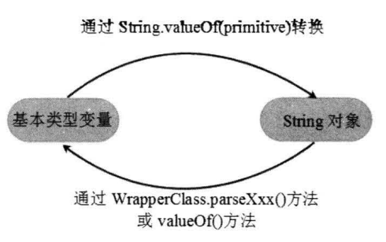

# Java8增强的包装类及其用法
Java是面向对象的编程语言，但它也包含了8种基本数据类型，这8种基本数据类型不支持面向对象的编程机制，基本数据类型的数据也不具备"对象"的特性：没有成员变量、方法可以被调用。

为了解决8种基本数据类型的变量不能当成`Object`类型变量使用的问题，Java提供了包装类`(Wrapper Class)`的概念，为8种基本数据类型分别定义了相应的`引用类型`，并称之为`基本数据类型`的`包装类`。

|  基本数据类型   | 包装类  |
|  :----:  | :----:  |
| byte | Byte |
| short | Short |
| int | Integer |
| long | Long |
| char | Character |
| float | Float |
| double | Double |
| boolean | Boolean |

从上表可以看出，除`int`和`char`有点例外之外，其它的`基本数据类型`对应的包装类都是将其首字母大写即可。
* 在JDK1.5之前
    * `基本数据类型变量`变成`包装类实例`需要通过对应`包装类`的`valueOf()`静态方法来实现。
    * 若想获得`包装类对象`中包装的`基本类型变量`，需要使用`包装类`提供的`xxxValue()`实例方法来实现。
* 在JDK1.5之后
    * JDK1.5提供了`自动装箱((Autoboxing)`和`自动拆箱(AutoUnboxing)`功能。
        * `自动装箱`：可以把1个`基本类型变量`直接赋给对应的`包装类变量`。或者赋值给`Object变量`(Object是所有类的父类，子类对象可以直接赋值给父类变量)。
        * `自动拆箱`：允许直接把`包装类对象`直接赋给一个对应的`基本类型变量`。
        * `自动装箱/自动拆箱`代码示例
            ```java
            package com.abc.part5;
            
            /**
             * @author mi
             */
            public class AutoBoxingUnboxing {
                public static void main(String[] args) {
                    //直接把一个int基本类型变量赋值给integer类型的变量
                    Integer intVar1 = 5;
                    //直接把一个int基本类型变量赋值给Object类型的变量
                    Object intVar2 = 6;
                    //直接把一个boolean基本类型变量赋值给Object类型的变量
                    Object boolVar3 = true;
                    int aa = intVar1;
                    System.out.println("intVar2:" + intVar1);
                    System.out.println("intVar2:" + intVar2);
                    System.out.println("boolVar3:" + boolVar3);
                    System.out.println("aa:" + boolVar3);
                    if (boolVar3 instanceof Boolean) {
                        boolean bb = (Boolean) boolVar3;
                        System.out.println("bb:" + bb);
                    }
                    /**
                     * 输出：
                     * intVar2:5
                     * intVar2:6
                     * boolVar3:true
                     * aa:true
                     * bb:true
                     */
                }
            }
            ```
    * JDK提供了`自动装箱`和`自动拆箱`功能后,大大简化了`基本类型变量`和`包装类对象`之间的转换过程。
## 基本类型变量和和字符串之间的相互转换
1. 把`字符串类型的值`转换为`基本类型的值`的两种方式
    1. 利用包装类提供的`parseXxx(String s)`静态方法(除`Character`之外的所有包装类都提供了该方法。)
    2. 利用包装类提供的`valueOf(String s)`静态方法。
2. 将`基本类型变量`转换成`字符串`
    1.String类提供了多个重载`valueOf()`方法，用于将`基本类型变量`转换成`字符串`。
    2. 将`基本类型变量`和`""(字符串)`用`+`进行连接运算，系统会自动把`基本类型变量`转换成`字符串`。
        ```java
        package com.abc.part5;
        public class Primitive2String {
            public static void main(String[] args) {
                // intStr 的值为 5"
                String intStr = 5 + ""; 
            }
        }
        ```
### 代码示例
```java
package com.abc.part5;

/**
 * @author mi
 */
public class Primitive2String {
    public static void main(String[] args) {
        //把一个特定字符串转换成 int 变量
        String intStr = "2020";
        int aa = Integer.parseInt(intStr);
        int ab = Integer.valueOf(intStr);
        System.out.println("aa:" + aa);
        System.out.println("ab:" + ab);
        System.out.println("*********************************************************");
        //把一个特定字符串转换成 float 变量
        String floatStr = "21.56";
        float ac = Float.parseFloat(floatStr);
        float ad = Float.valueOf(floatStr);
        System.out.println("ac:" + ac);
        System.out.println("ad:" + ad);
        System.out.println("*********************************************************");
        //把一个 float 变量转换成 String 变量
        String ftStr = String.valueOf(78.9f);
        System.out.println("ftStr:" + ftStr);
        //把一个double 变量转换成 String 变量
        String dbStr = String.valueOf(78.999);
        System.out.println("dbStr:" + dbStr);
        //把一个boolean变量转换成String变量
        String boolStr1 = String.valueOf(false);
        String boolStr2 = String.valueOf(true);
        System.out.println("boolStr1:" + boolStr1);
        System.out.println("boolStr2:" + boolStr2);
        /**
         * 输出
         * aa:2020
         * ab:2020
         * *********************************************************
         * ac:21.56
         * ad:21.56
         * *********************************************************
         * ftStr:78.9
         * dbStr:78.999
         * boolStr1:false
         * boolStr2:true
         */
    }
}
```
通过上面程序可以看出基本类型变量和字符串之间的转换关系,如下图所示


## 包装类的实例与数值类型的值进行比较
虽然`包装类型的变量`是`引用数据类型`，但`包装类的实例`可以与`数值类型的值`进行`比较`，这种比较是直接取出`包装类实例所包装的数值`来进行比较的。

### 代码示例
```java
package com.abc.part5;

/**
 * @author mi
 */
public class WrapperClassCompare {
    public static void main(String[] args) {
        //一个包装类实例与数值进行比较
        Integer aa = Integer.valueOf("6");
        Integer ab = Integer.valueOf("6");
        //false
        System.out.println(aa > 7);
        //两个包装类实例进行比较
        //true
        System.out.println(Integer.valueOf("5").equals(Integer.valueOf("5")));
        //true
        System.out.println(aa.equals(ab));

    }
}
```
## 包装类的compare()方法
Java7为所有的包装类都提供了一个静态的`compare(xxx val1 , xxx val2)` 方法，这样开发者就可以通过包装类提供的`compare(xxx val1, xxx val2)`方法来比较两个`基本类型值`的大小，包括比较两个`boolean`类型值。
```java
package com.abc.part5;

/**
 * @author mi
 */
public class WrapperClassCompare1 {
    public static void main(String[] args) {
        System.out.println("******************************");
        System.out.println(Integer.compare(10, 11));
        System.out.println(Integer.compare(10, 10));
        System.out.println(Integer.compare(11, 10));
        System.out.println("******************************");
        System.out.println(Float.compare(10.12f, 11.34f));
        System.out.println(Float.compare(10.12f, 10.12f));
        System.out.println(Float.compare(11.34f, 10.12f));
        System.out.println("******************************");
        System.out.println(Double.compare(10.79, 11.54));
        System.out.println(Double.compare(10.79, 10.79));
        System.out.println(Double.compare(11.54, 10.79));
        System.out.println("******************************");
        System.out.println(Character.compare('中', '国'));
        System.out.println(Character.compare('中', '中'));
        System.out.println(Character.compare('国', '中'));
        System.out.println("..............................");
        System.out.println(Character.compare('华', '夏'));
        System.out.println(Character.compare('华', '华'));
        System.out.println(Character.compare('夏', '华'));
        System.out.println("******************************");
        System.out.println(Boolean.compare(true, false));
        System.out.println(Boolean.compare(true, true));
        System.out.println(Boolean.compare(false, true));
        /**
         * 输出：
           ******************************
           -1
           0
           1
           ******************************
           -1
           0
           1
           ******************************
           -1
           0
           1
           ******************************
           -2256
           0
           2256
           ..............................
           -1473
           0
           1473
           ******************************
           1
           0
           -1
         */

    }
}
```

# 处理Java对象
Java对象都是Object类的实例，都可直接调用该类中定义的方法,这些方法提供了处理Java对象的通用方法。
## 打印对象和toString()方法
toString()方法是Object类里的一个实例方法，所有的Java类都是Object类的子类，因此所有的Java对象都具有toString()方法。
```java
package com.abc.part5;

public class PersonTest {
    public static void main(String[] args) {
        Person p = new Person("小花花");
        //com.abc.part5.Person@60e53b93
        System.out.println(p);
        /**
         * 所有的 Java 对象都可以和字符串进行连接运算，当 Java 对象和字符串进行连接运算时，
         * 系统自动调用 Java 对象 toString()方法的返回值和字符串进行连接运算。
         */
        //com.abc.part5.Person@60e53b93
        System.out.println(p + "");
        //com.abc.part5.Person@60e53b93
        System.out.println(p.toString() + "");
    }
}
```
* toString()方法功能：当程序员直接打印该对象时，系统将会输出该对象的"自我描述"信息，用以告诉外界该对象具有的状态信息。
* `Object类`提供的`toString()`方法总是返回该`对象实现类`的`类名+@+hashCode`值，这个返回值并不能真正实现`自我描述`的功能，因此如果用户需要`自定义类`能实现`自我描述`的功能，就必须**重写**`Object类`的`toString()`方法。
### 代码示例
```java
package com.abc.part5;

public class Apple {
    private String color;
    private double price;

    public Apple(String color, double price) {
        this.color = color;
        this.price = price;
    }

    public String getColor() {
        return color;
    }

    public void setColor(String color) {
        this.color = color;
    }

    public double getPrice() {
        return price;
    }

    public void setPrice(double price) {
        this.price = price;
    }


    /**
     * @return String
     */
    @Override
    public String toString() {
        return "水果市场里的" + color + "的苹果的价格是每斤" + price + "元。";
    }
}
```
```java
package com.abc.part5;

public class AppleTest {


    public static void main(String[] args) {
        Apple apple = new Apple("红色", 3.99);
        //水果市场里的红色的苹果的价格是每斤3.99元。
        System.out.println(apple.toString());
    }
}
```
从上面运行结果可以看出，通过重写Apple类的`toString()`方法，就可以让系统在打印Apple对象时打印出该对象的"自我描述"信息。
* 大部分时候，重写`toString()`方法总是返回该对象的所有令人感兴趣的信息所组成的字符串。通常可返回如下格式的宇符串:
    ```bash
    类名[field1=value1, field2=value2]
    ```

## ==和equals()方法

                 


                                                                                        