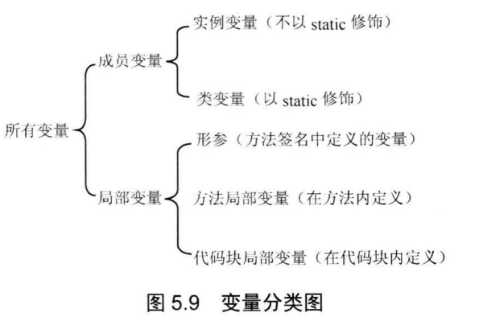

# 面向对象(上)
Java是面向对象的程序设计语言， Java 语言提供了定义类、成员变量、方法等最基本的功能 。
## 类与对象
所有使用类定义的变量都是引用变量，它们将会引用到类的对象。也就是说，所有类是引用类型。
### 定义类
面向对象的程序设计过程中有两个重要概念:类(class)和对象(object，也被称为实例，instance),其中类是某一批对象的抽象，可以把类理解成某种概念。对象才是一个具体存在的实体，从这个意义上来看，日常所说的人，其实都是人的实例，而不是人类。

定义类语法格式
```bash
[修饰符] class 类名
{
    零个到多个构造器定义...
    零个到多个成员变量...
    零个到多个方法...
}
```
在上边的语法格式中
* 修饰符可以是`public`，`final`，`abstract`，或者完全省略这三个修饰符
* 类名命名规则遵循`大驼峰命名法`规则：每个单词首字母大写，其他字母全部小写，单词与单词之间不要使用任何分隔符。
    * 例如
    ```bash
    MyTest、HandleExcel、HandleRequests
    ```
#### 类的组成
一个类通常包含三中最常见的成员。
* 构造器
    * 构造器是一个类创建对象的根本途径，如果一个类没有构造器，这个类通常无法创建实例。
    * 因此，Java语言提供了一个功能：如果程序员没有为一个类编写构造器，则系统会为该类提供一个默认的构造器。一旦程序员为一个类提供了构造器，系统将不再为该类提供构造器。
* 成员变量：成员变量用于定义该类或该类的实例所包含的状态数据。
* 方法：方法则用于定义该类或该类的实例的行为特征或者功能实现。

需要注意的点
1. 类中的成员数量无限制。
2. 类中各成员之间的定义顺序没有要求，各成员之间可以互相调用。但是`static`修饰的成员不能访问没有`static`修饰的成员。
#### 成员变量
定义成员变量语法格式
```bash
[修饰符] 类型 成员变量名 [=默认值];
```
成员变量详细说明
* 修饰符
    * 可以省略
    * 可以是`public`，`protected`，`private`，`static`，`final`,其中`public`，`protected`，`private`三个最多只能出现一个，可以与`static`，`final`组合使用来修饰成员变量
* 类型
    * 不可省略，可以是基本数据类型和引用数据类型。
* 成员变量名
    * 遵循`小驼峰命名法`规则：第一个单词首字母小写，后面每个单词首字母大写，其他字母全部小写，单词与单词之间不要使用任何分隔符。
* 默认值
    * 定义成员变量还可以指定 个可边的默认值

#### 方法
定义方法语法格式
```bash
[修饰符] 方法返回值类型 方法名(形参列表)
{
    //由零条或多条可执行语句组成的方法体
}
```
方法详细说明
* 修饰符
    * 可以省略
    * 可以是`public`，`protected`，`private`，`static`，`final`,其中`public`，`protected`，`private`三个最多只能出现一个，可以与`static`，`final`组合使用来修饰方法
* 方法返回值类型
    * 返回值类型可以是基本数据类型和引用类型
    * 如果声明了方法返回值类型，方法体内必须提供一个`return`语句，返回一个变量或表达式。变量或者表达式的类型必须与此处声明的类型匹配。
    * 如果未声明方法返回值类型，必须使用void声明该方法没有返回值。
* 方法名
    * 方法名命名规则与成员变量命名规则一致。
* 形参列表
    * 形参列表用于定义该方法可以接受的参数
    * 格式：由零组或多组形参组成
        * 零组就是值该方法没有形参
        * 一组形参：`(数据类型 形参名)`
        * 多组形参：`(数据类型 形参名1, 数据类型 形参名2)`
    * 一旦定义方法时指定了形参列表，调用方法时必须传入对应的参数值(谁调用方法，谁负责为形参赋值)
* 方法体
    * 方法体里多条可执行性语句之间有严格的执行顺序，排在方法体前面的语句总是先执行，排在方法体后面的语句总是后执行。
#### `static`关键字
`static`的真正作用就是用于区分成员变量、方法、内部类、初始化块这四种成员到底属于类本身还是属于实例。

在类中定义的成员，`static`相当于一个标志，有`static`修饰的成员属于类本身，没有`static`修饰的成员属于该类的实例。
* 通常把`static`修饰的成员变量和方法也称为类变量、类方法。
* 不使用`static`修饰的普通方法、成员变量则属于该类的单个实例，而不属于该类。因此通常把不使用`static`修饰的成员变量和方法也称为实例变量、实例方法。
#### 构造器
构造器是一个特殊的方法，定义构造器的语法格式与定义方法的语法格式很像，定义构造器的语法格式如下:
```bash
[修饰符] 构造器名 (形参列表)
{
    //由零条到多条可执行性语句组成的构造器执行体
}
```
构造器详细说明
* 修饰符
    * 可以省略
    * 可以是`public`，`protected`，`private`其中之一
* 构造器名字：构造器名字必须与类名相同。
* 形参列表：和定义方法形参列表的格式完全相同。
使用构造器时需要注意的点
* 构造器既不能定义返回值类型，也不能使用`void`声明构造器没有返回值。
* 如果为构造器定义了返回值类型，或使用`void`声明构造器没有返回值，编译时不会出错，但`Java`会把这个所谓的构造器当成方法来处理——>它就不再是构造器。

构造器不是没有返回值吗，为什么不能用void来声明呢？
1. 这是Java语法的规定
2. 实际上，类的构造器是有返回值的。当使用new关键字来调用构造器时，构造器返回该类的实例，可以把这个类的实例当成构造器的返回值，因此构造器的返回值类型总是当前类，无需定义返回值类型。
3. 必须注意：不要在构造器里显式使用`return`来返回当前类的对象，因为构造器的返回值是隐式的。

#### 定义一个`Person`类
```java
public class Person{
    //定义两个成员变量
    public String name;
    public int age;
    //定义一个say方法
    public void say(String content){
        System.out.println(content);
    }
}
```
上边的Person类里没有手动定义构造器，系统自动为该类提供一个构造器，系统提供的构造器总是没有参数的。

#### Java中类的作用
* 定义变量
* 创建对象
* 调用类的类方法或访问类的类变量。
### 使用类
#### 对象的产生和使用
创建对象的根本途径是构造器，通过new关键字来调用某个类的构造器即可创建这个类的实例。

##### 创建对象
```bash
//使用Person类定义一个Person类型的变量
Person p;
//通过new关键字调用Person类的构造器，返回一个Person实例
//讲该Person实例赋值给p
p = new Person();
//上边代码可以简写成一行代码
Person p = new Person();
```
##### 使用对象
Java的对象大致有如下作用
* 访问对象的实例变量(也叫实例属性)
* 调用对象的方法

注意点
* 类或实例访问方法或成员变量的语法是:`类.类变量|方法`，或者`实例.实例变量|方法`
* `static`修饰的方法和成员变量，既可通过类来调用，也可通过实例来调用
* 没有使用`static`修饰的普通方法和成员变量，只可通过实例来调用
* 如果堆内存里的对象没有任何变量指向该对象，那么程序将无法再访问该对象，这个对象也就变了垃圾，Java的垃圾回收机制将回收该对象，释放该对象所占的内存区。
* 如果希望通知垃圾回收机制回收某个对象，只需要切断该对象的所有引用变量和它之间的关系即可，也就是把这些引用变量赋值为**`null`**。

代码示例

**`Person.java`**
```java
package com.abc.part_four;

public class Person {
    //定义两个成员变量
    public String name;
    public int age;

    //定义一个say方法
    public void say(String content) {
        System.out.println(content);
    }

}
```
**`PersonTest.java`**
```java
package com.abc.part_four;

public class PersonTest {
    public static void main(String[] args) {
        Person p = new Person();
        System.out.println("***************未对Person类的实例属性name，age进行赋值前***************");
        System.out.println(p.name);
        System.out.println(p.age);
        p.name = "小明";
        p.age = 21;
        System.out.println("***************对Person类的实例属性name，age进行赋值后***************");
        System.out.println(p.name);
        System.out.println(p.age);
        System.out.println("***************调用Person类的实例方法say***************");
        p.say("人生苦短,Let's Go!");
    }


}
```
运行`PersonTest.java`输出以下结果
```bash
***************未对Person类的实例属性name，age进行赋值前***************
null
0
***************对Person类的实例属性name，age进行赋值后***************
小明
21
***************调用Person类的实例方法say***************
人生苦短,Let's Go!
```
大部分时候，定义一个类就是为了重复创建该类的实例，同一个的多个实例具有相同的特征，而类则是定义了多个实例的共同特征。从某个角度来看，类定义的是多个实例的特征，因此类不是一种具体存在，实例才是具体存在 。完全可以这样说:你不是人这个类，我也不是人这个类，我们都只是人的实例。

#### 对象`this`的使用
Java中this关键字总是指向调用该方法的对象。this作为对象的默认引用有两种情形：
1. 构造器中引用该构造器正在初始化的对象。
2. 在方法中引用调用该方法的对象。

##### 在方法中引用调用该方法的对象
`this`关键宇最大地作用就是让类中一个方法，访问该类里的另一个方法或实例变量。

代码示例

**`Dog1.java`**
```java
package com.abc.part_four;

public class Dog1 {
    public String dogName;

    public void jump() {
        System.out.println("Dog jump~");
    }

    public void run() {
        dogName = "小花花";
        Dog1 dog = new Dog1();
        dog.jump();//假设Dog run的前提是Dog jump
        System.out.println("Dog run~");
    }
}
```
**`Dog2.java`**
```java
package com.abc.part_four;

public class Dog2 {
    public String dogName;

    public void jump() {
        System.out.println("Dog jump~");
    }

    public void run() {
        dogName = "小花花";
        this.jump();//假设Dog run的前提是Dog jump
        System.out.println("Dog run~");
    }
}
```
**`Dog3.java`**
```java
package com.abc.part_four;

public class Dog3 {
    public String dogName;

    public void jump() {
        System.out.println("Dog jump~");
    }

    public void run() {
        dogName = "小花花";
        jump();//假设Dog run的前提是Dog jump
        System.out.println("Dog run~");
    }
}
```
**`DogTest.java`**
```java
package com.abc.part_four;

public class DogTest {
    public static void main(String[] args) {
        System.out.println("*********Dog1*********");
        Dog1 d1 = new Dog1();
        // 调用Dog1里的run方法，创建两个Dog对象
        d1.run();
        /**
         * 这里产生了两个问题
         * 第一个问题：Dog1类中run()方法中调用jum()方法时是否一定需要一个Dog对象?
         * 第二个问题:是否一定需要重新创建一个Dog对象?
         * 第一个问题的答案是肯定的，因为没有使用static修饰的成员变量和方法都必须使用对象来调用 。
         * 第二个问题的答案是否定的，因为当程序调用run()法时，一定会提供一个Dog对象，这样就可以直接使用这个己经存在的Dog对象，而无须重新创建新Dog对象了.
         * 因此需要在run()方法中获得调用该方法的对象，通过this关键字就可以满足这个要求。
         *
         * this可以代表任何对象，当this出现在某个方法体中时，它所代表的对象是不确定的，但它的类型是确定的：它所代表的只能是当前类的实例，只有当这个方法被调用时，它所代表的对象才被确定下来：谁在调用这个方法，this就代表谁。
         * 因此将Dog1中run()方法中使用this关键字来调用jump()方法会更合适些。
         * 代码如Dog2所示
         */
        System.out.println("*********Dog2*********");
        Dog2 d2 = new Dog2();
        //调用Dog1里的run方法，只创建了一个Dog对象
        d2.run();
        /**
         * this关键字可以省略
         * 代码如Dog3所示
         */
        System.out.println("*********Dog3*********");
        Dog3 d3 = new Dog3();
        d3.run();


    }
}
```
对于static修饰的方法而言，可以使用类来直接调用该方法，static修饰的方法中不能使用this引用。
* 由于static修饰的方法不能使用this引用，所以static修饰的方法不能访问不使用static修饰的普通成员，因此Java语法规定:静态成员(包括方法、成员变量)不能直接访问非静态成员(包括方法、成员变量)。

静态方法直接访问非静态方法时引发错误代码示例
```java
package com.abc.part_four;

public class StaticAccessNonStatic {
    public void say1(){
        System.out.println("一个简单的非静态方法");
    }
    public static void say2(){
        System.out.println("一个简单的静态方法");
    }
    public static void main(String[] args){
        //执行程序编译时会报错：Error:(11, 9) java: 无法从静态上下文中引用非静态 方法 say1()。
        // 因为say1()是属于示例的方法不是属于类的方法。因此必须需要使用对象来调用该方法。
        //say1();
        /**
         * 在上面的main()方法中直接调用say1()方法时，系统相当于使用this作为该方法的调用者，
         * 而main()方法是static修饰的方法，static修饰的方法属于类，而不属于对象，因此调用static修饰的方法的主调总是类本身.
         */
        //如果确实需要在静态方法里调用非静态方法。可以创建类对象，使用类对象来调用非静态方法。
        new StaticAccessNonStatic().say1();//输出：一个简单的非静态方法
        //执行不会报错
        say2();//输出：一个简单的静态方法
    }
}
```
大部分时候，普通方法访问其他方法、成员变量时无须使用**`this`**前缀 ，但如果方法里有个局部变量和成员变量同名，但程序又需要在该方法里访问这个被覆盖的成员变量，则必须使用**`this1**前缀。
##### 构造器中引用该构造器正在初始化的对象(简单来说就是在构造器中使用this关键字)
`this`引用也可以用于构造器中作为默认引用，由于构造器是直接使用`new`关键宇来调用，而不是使用对象来调用的，所以`this`在构造器中代表该构造器正在初始化的对象。

代码示例
```java
package com.abc.part_four;

public class ThisInConstructor {
    public String name;

    //定义一个构造器
    public ThisInConstructor() {
        //在构造器里定义一个name变量
        String name;
        //使用this代表该构造器正在初始化的对象
        //下面的代码将会把该构造器正在初始化的对象的name成员变量设置成`小花花`
        this.name = "小花花";
    }

    public static void main(String[] args) {
        System.out.println(new ThisInConstructor().name);//小花花
    }
}
```
程序输出
```bash
小花花
```
## 方法详解
方法是类或对象的行为特征的抽象，方法是类或对象最重要的组成部分。

Java里的方法不能独立存在，所有的方法都必须定义在类里。方法在逻辑上要么属于类，要么属于对象。

### Java里方法的所属性
* 方法不能独立定义，方法只能在类里边定义
* 从逻辑意义上来讲，方法要么属于该类本身，要么属于该类的一个对象
* 永远不能独立执行方法，执行方法必须使用类或对象作为调用者。

### 方法调用
1. 使用`static`修饰的方法，可以使用`类`或`类对象`来调用。
2. 不使用`static`修饰的方法，只能使用类对象来调用。

### 方法参数传递机制
Java里方法参数传递方式只有一种：`值传递`，所谓值传递，就是将`实际参数值的副本(复制品)`传入方法内，而参数本身不会受到任何影响。

基本类型的值传递代码示例
```java
package com.abc.part_four;

/**
 * @Auther: ABC
 * @Date: 2020/5/3 12:27
 * @Description: 验证值传递就是将`实际参数值的副本(复制品)`传入方法内，而参数本身不会受到任何影响。
 */
public class PrimitiveTransferTest {
    public static void swap(int a, int b) {
        int tmp = a;
        a = b;
        b = tmp;
        System.out.println("a和b交换后的值为：" + "a = " + a + ", b = " + b);
    }

    public static void main(String[] args) {
        /**
         * 当程序执行swap()方法时,系统进入swap()方法，并将main()法中的a,b变量作为参数值传入swap()方法,
         * 传入swap()方法的只是a,b的副本，而不是a,b本身。
         */
        int a = 3;
        int b = 4;
        swap(3, 4);
        System.out.println("交换结束后的a, b值为：" + "a = " + a + ", b = " + b);
    }
    /**
     * 输出：
     * a和b交换后的值为：a = 4, b = 3
     * 交换结束后的a, b值为：a = 3, b = 4
     */
}
```
引用类型的值传递代码示例
```java
package com.abc.part_four;

/**
 * @Auther: ABC
 * @Date: 2020/5/3 12:56
 * @Description: 引用类型的值传递代码示例：验证值传递就是将`实际参数值的副本(复制品)`传入方法内，而参数本身不会受到任何影响。
 */
public class ReferenceTransferTest {
    public static void swap(String a, String b) {
        String tmp = a;
        a = b;
        b = tmp;
        System.out.println("a和b交换后的值为：" + "a = " + a + ", b = " + b);
    }

    public static void main(String[] args) {
        String a = "小花花";
        String b = "小亮亮";
        swap(a, b);
        System.out.println("交换结束后的a, b值为：" + "a = " + a + ", b = " + b);
        /**
         * 输出：
         * a和b交换后的值为：a = 小亮亮, b = 小花花
         * 交换结束后的a, b值为：a = 小花花, b = 小亮亮
         */

    }
}

```
### 值传递的实质
当系统开始执行方法时，系统为形参执行初始化，就是把实参变量的值赋给方法的形参变量，方法里操作的并不是实际的实参变量。

### 形参个数可变的方法
如果在定义方法时，在最后一个形参的类型后增加三点(...)，则表明该形参可以接受多个参数值，多个参数值被当成`数组`传入。

代码示例
```java
package com.abc.part_four;

import java.util.Arrays;

/**
 * @Auther: ABC
 * @Date: 2020/5/3 21:48
 * @Description:
 */
public class Varargs {
    public static void test(int a, String... books) {
        System.out.println("一共" + a + "本书, " + Arrays.toString(books));
        System.out.println("分别是以下这些书：");
        for (String book : books){
            System.out.println(book);
        }
    }

    public static void main(String[] args) {
        test(3, "疯狂Java讲义", "疯狂Python讲义", "Java核心技术卷");
        /**
         * 输出：
         * 一共3本书, [疯狂Java讲义, 疯狂Python讲义, Java核心技术卷]
         * 分别是以下这些书：
         * 疯狂Java讲义
         * 疯狂Python讲义
         * Java核心技术卷
         */
    }
}
```
需要注意的点
* 数组形式的形参可以处于形参列表的任意位置，但个数可变的形参(如`String... books`)只能处于形参列表的最后。
* 一个方法中最多只能有一个`个数可变的形参`。
* 个数可变的形参本质就是一个数组类型的形参
### 递归方法
一个方法体内调用它自身，被称为方法递归。方法递归包含了一种隐式的循环，它会重复执行某段代码，但这种重复执行无须循环控制。

递归方法实现`计算数字阶乘`和`斐波拉切数列`，代码示例
```java
package com.abc.part_four;

import java.util.ArrayList;
import java.util.List;
import java.util.Scanner;

/**
 * @Auther: ABC
 * @Date: 2020/5/3 22:29
 * @Description:
 */
public class Recursive {
    /**
     * 计算一个整数的阶乘,如果用字母n来代表一个整数，阶乘代表着所有`小于或等于n`且大于0的整数的乘积。
     * 阶乘通常简写成 n!
     * 例如: 5! = 1 * 2 * 3 * 4 * 5 = 120
     *
     * @param n
     * @return 计算结果
     */
    public static int fn(int n) {
        if (n == 1) {
            return 1;
        } else {
            //方法中调用它自身,就是方法递归
            return n * fn(n - 1);
        }
    }

    /**
     * 递归函数实现斐波那契数列
     * 斐波那契数列：[1,1,2,3,5,8,13,21,34....],第一个数是1，后面的数等于前面两个数相加的结果
     * 打印1-50内的斐波拉切数列
     *
     * @param m
     * @return 计算结果
     */
    public static int fn1(int m) {
        if (m == 1 || m == 2) {
            return 1;
        } else {
            return fn1(m - 1) + fn1(m - 2);
        }
    }


    public static void main(String[] args) {
        int result = fn(5);
        System.out.println("5! = " + result);//5! = 120

        Scanner scanner = new Scanner(System.in);
        System.out.println("请输入需要打印斐波拉契数列中的数字个数：");
        int numCount = scanner.nextInt();
        List<Integer> list=new ArrayList<Integer>();
        for (int i = 1; i <= numCount; i++){
            list.add(fn1(i));
        }
        System.out.print("斐波拉契数列中前" + numCount + "个数字为：" + list);
        /**
         * 输出：
         * 5! = 120
         * 请输入需要打印斐波拉契数列中的数字个数：
         * 10
         * 斐波拉契数列中前10个数字为：[1, 1, 2, 3, 5, 8, 13, 21, 34, 55]
         */
    }
}
```
### 方法重载
Java允许同一个类里定义多个同名方法，只要形参列表不同就行。如果同一个类中包含了两个或两个以上方法的方法名相同，但形参列表不同，则被称为方法重载。

确定一个方法的三个要素
* 调用者，也就是方法的所有者，可以是类，也可以是对象。
* 方法名。
* 形参列表，当调用方法时，系统会根据传入的实参列表进行匹配。

方法重载的要求：二同一不同
* 同一个类中方法名相同，参数列表不同。方法返回值类型、修饰符等，与方法重载没有任何关系。
```java
package com.abc.part_four;

public class OverLoad {
    /*
    方法重载,同一个类中，方法名相同，形参列表不同。
     */
    public void test(String name, int age) {
        System.out.println("我的名字是:" + name + ", 我的年龄是:" + age);
    }

    public void test(String name, char gender) {
        System.out.println("我的名字是:" + name + ", 我的性别是:" + gender);
    }

    public static void main(String[] args) {
        OverLoad overLoad = new OverLoad();
        overLoad.test("小花花", 21);
        overLoad.test("小花花", '女');
        /**
         * 输出：
         * 我的名字是:小花花, 我的年龄是:21
         * 我的名字是:小花花, 我的性别是:女
         */
    }
}
```
### 成员变量和局部变量
在Java语言中，根据定义变量位置的不同，可以将变量分成两大类：成员变量和局部变量。
* 成员变量
    * 成员变量指的是在类里定义的变量。
* 局部变量
    * 局部变量指的是在方法里定义的变量。

变量分类图

#### 成员变量
成员变量被分为类变量和实例变量两种，定义成员变量时`没有static`修饰的就是实例变量，`有static`修饰的就是类变量。
* 类变量从该类的准备阶段起开始存在，直到系统完全销毁这个类，类变量的作用域与这个类的生存范围相同。
* 实例变量则从该类的实例被创建起开始存在，直到系统完全销毁这个实例，实例变量的作用域与对应实例的生存范围相同。

正是基于以上的原因，可以把类变量和实例变量统称为成员变量。
* 类变量可以理解为类成员变量，它作为类本身的一个成员，与类本身共存亡;
* 实例变量则可理解为实例成员变量，它作为实例的一个成员，与实例共存亡。

只要类存在，程序就可以访问该类的类变量。在程序中访问类变量通过如下语法：
```bash
类.类变量
```
只要实例存在，程序就可以访问该实例的实例变量。在程序中访问实例变量通过如下语法：
```bash
实例.实例变量
```
当然，类变量也可以让该类的实例来访问。通过实例来访问类变量的语法如下:
```bash
实例.类变量
```
代码示例

**`Person1.java`**
```java
package com.abc.part_four;

public class Person1 {
    public String name;
    public static int eyeNum;
}
```
**`Person1Test.java`**
```java
package com.abc.part_four;

public class Person1Test {
    public static void main(String[] args) {
        Person1 person1 = new Person1();
        Person1 person2 = new Person1();
        System.out.println("1)我的名字是：" + person1.name + ", 我有" + Person1.eyeNum + "只眼睛。");
        //通过Person1类访问类变量
        Person1.eyeNum = 1;
        System.out.println("2)我的名字是：" + person1.name + ", 我有" + Person1.eyeNum + "只眼睛。");
        //通过Person1类示例访问类变量
        person1.eyeNum = 2;
        System.out.println("3)我的名字是：" + person1.name + ", 我有" + Person1.eyeNum + "只眼睛。");
        //通过Person1类示例person1访问实例变量
        person1.name = "小花花";
        System.out.println("4)我的名字是：" + person1.name + ", 我有" + Person1.eyeNum + "只眼睛。");
        ////通过Person1类示例person2访问类变量eyeNum，访问到的是修改后的eyeNum
        System.out.println("5)我的名字是：" + person2.name + ", 我有" + Person1.eyeNum + "只眼睛。");
        /**
         * 程序输出：
         * 1)我的名字是：null, 我有0只眼睛。
         * 2)我的名字是：null, 我有1只眼睛。
         * 3)我的名字是：null, 我有2只眼睛。
         * 4)我的名字是：小花花, 我有2只眼睛。
         * 5)我的名字是：null, 我有2只眼睛。
         */
    }
}
```
从上面程序运行结果不难发现，类变量的作用域比实例变量的作用域更大。实例变量随实例的存在而存在，而类变量则随类的存在而存在。实例也可访问类变量，同一个类的所有实例访问类变量时，实际上访问的是该类本身的同一个变量，也就是说，访问了同一片内存区。

如前面提到的，Java允许通过实例来访问`static`修饰的`成员变量`本身就是一个错误, 因此以后看到通过实例来访问成员变量的情形，都可以将它替换成通过类本身来访问`static`成员变量的情形，这样程序的可读性、明确性都会大大提高。

#### 局部变量
局部变量根据定义形式的不同，又可以被分为如下三种
* 形参：在定义方法时定义的变量，形参的作用域在整个方法内有效。
    * 形参的作用域是整个方法体内有效，而且形参也无须**`显式初始化`**，形参的初始化在调用该方法时由系统完成，形参的值由方法的调用者负责指定。
    * 当通过类或对象调用某个方法时，系统会在该方法枝区内为所有的形参分配内存空间，并将实参的值赋给对应的形参，这就完成了形参的初始化。
    ```java
    package com.abc.part_four;
    
    public class VariableOverrideTest {
        //创建两个成员变量
        private String name = "小花花";//实例变量
        private static int age = 21;//；类变量
    
        public void info(char gender) {
            String name = "大花花";
            System.out.println("我叫" + name + ", 性别是：" + gender);//我叫大花花, 性别是：女
            //使用this来调用实例变量
            System.out.println(this.name);//小花花
    
        }
    
        public static void main(String[] args) {
            //创建一个局部变量
            int age = 22;
            System.out.println("我的年龄是" + age);//我的年龄是22
            System.out.println("小花花的年龄是" + VariableOverrideTest.age);//小花花的年龄是21
            new VariableOverrideTest().info('女');
        }
    }
    ```
    从上面代码可以清楚地看出局部变量覆盖成员变量时，依然可以在方法中显式指定类名和使用`this(只能用来调用实例变量，不能调用类变量)`作为调用者来访问被覆盖的成员变量。这使得编程更加自由，不过大部分时候还是应该尽量避免这种局部变量和成员变量同名的情形。
* 方法局部变量：在方法体内定义的局部变量，作用域是从定义该变量的地方开始生效，到该方法结束时失效。
    ```java
    package com.abc.part_four;
    
    public class MethodLocalVariableTest {
        public static void main(String[] args) {
            int b;//定义一个方法局部变量b
            //System.out.println("方法局部变量的值为：" + b);//会报错，因为方法局部变量还为进行初始化。
            b = 7;//为方法局部变量进行赋值，也就是进行初始化。
            System.out.println("方法局部变量的值为：" + b);//方法局部变量的值为：7
    
    
        }
    }
    ```
* 代码块局部变量：在代码块中定义的局部变量，作用域是从定义该变量的地方开始生效，到该代码块结束时失效。
    ```java
    package com.abc.part_four;
    
    public class BlockTest {
        public static void main(String[] args) {
            {
                int a;//定义一个代码块局部变量a
                //System.out.println("代码块局部变量a的值为：" + a);//会报错，因为未对代码块局部变量a做初始化，
                a = 5;
                System.out.println("代码块局部变量a的值为：" + a);//初始化局部变量a后才可以正常进行编译和输出：代码块局部变量a的值为：5
            }
            //System.out.println(a);//会报错，代码块外是访问不到局部变量a的。
        }
    
    }
    ```
    从上边程序代码可以看出来，程序执行完代码块后，代码块局部变量a立即被销毁。代码块局部变量a只能在代码块中可以访问得到，在代码块是访问不到的。

#### 成员变量与局部变量比较
**`ScopeTest1.java`**
```java
package com.abc.part_four;

public class ScopeTest1 {
    //定义一个类成员变量作为循环变量
    static int i;

    public static void main(String[] args) {
        for (i = 1; i <= 10; i++) {
            System.out.println(i);
        }
    }
}
```
**`ScopeTest2.java`**
```java
package com.abc.part_four;

public class ScopeTest2 {
    public static void main(String[] args) {
        //定义一个方法局部变量作为循环变量
        int i;
        for (i = 1; i <= 10; i++) {
            System.out.println(i);
        }
    }
}
```
**`ScopeTest3.java`**
```java
package com.abc.part_four;

public class ScopeTest3 {
    public static void main(String[] args) {
        //定义一个代码块局部变量作为循环变量
        for (int i = 1; i <= 10; i++) {
            System.out.println(i);
        }
    }
}
```
以上三个程序执行结果完全相同，但是第三种最符合软件开发规范。对于一个循环变量而言，只需要它在循环体内有效即可，因此这个变量需要在代码块中进行定义，从而保证这个变量的作用域只在该代码块中。该局部变量占用的内存更小，程序性能更健壮。


