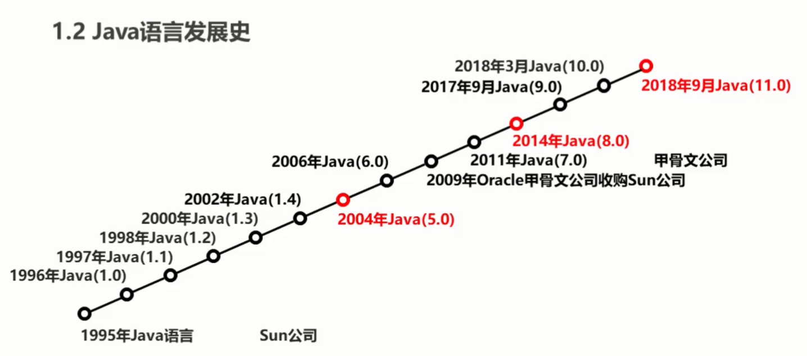
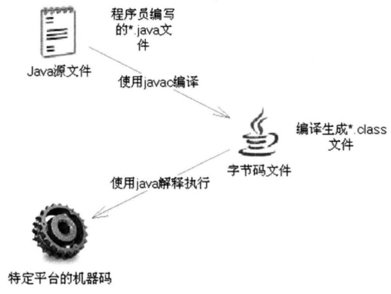

# Java语言概述与开发环境

## Java语言发展简史

### 概述

Java语言是一门非常纯粹的面向对象编程语言,它吸收了C++语言的各种优点,又摒弃了C++里难以理解的多继承、指针等概念,因此Java语言具有功能强大和简单易用两个特征。Java语言作为静态面向对象编程语言的代表,极好地实现了面向对象理论,允许程序员以优雅的思维方式进行复杂的编程开发。

### Java语言发展历程



## 编译型语言和解释型语言

Java语言是一种特殊的高级语言,它既具有解释型语言的特征,也具有编译型语言的特征,因为Java程序要经过先编译,后解释两个步骤。

计算机高级语言按程序的执行方式可以分为编译型和解释型两种。

* 编译型语言是指使用专门的编译器,针对特定平台(操作系统)将某种高级语言源代码一次性"翻译"成可被该平台硬件执行的机器码(包括机器指令和操作数),并包装成该平台所能识别的可执行性程序的格式,这个转换过程称为编译(Compile)。编译生成的可执行性程序可以脱离开发环境,在特定的平台上独立运行。
* 解释型语言是指使用专门的解释器对源程序逐行解释成特定平台的机器码并立即执行的语言。
    * 解释型语言通常不会进行整体性的编译和链接处理,解释型语言相当于把编译型语言中的编译和解释过程混合到一起同时完成。
    * 可以认为:每次执行解释型语言的程序都需要进行一次编译,因此解释型语言的程序运行效率通常较低,而且不能脱离解释器独立运行。但解释型语言有一个优势:跨平台比较容易,只需提供特定平台的解释器即可,每个特定平台上的解释器负责将源程序解释成特定平台的机器指令即可。解释型语言可以方便地实现源程序级的移植,但这是以牺牲程序执行效率为代价的。
    * 现有的JavaScript、Ruby、Python等语言都属于解释型语言。

## Java语言的编译,解释运行机制

Java语言比较特殊,由Java语言编写的程序需要经过编译步骤,但这个编译步骤并不会生成特定平台的机器码,而是生成一种与平台无关的字节码(也就是*.class文件)。当然,这种字节码不是可执行的,必须使用Java解释器来解释执行。因此可以认为:Java语言既是编译型语言,也是解释型语言。或者说,Java语言既不是纯粹的编译型语言,也不是纯粹的解释型语言。Java程序的执行过程必须经过先编译、后解释两个步骤,如下图所示。

)

## 通过JVM实现跨平台

* Java语言里负责解释执行字节码文件的是Java虚拟机,即JVM(JavaVirtualMachine) JVM是可运行Java字节码文件的虚拟计算机。所有平台上的JVM向编译器提供相同的编程接口,而编译器只需要面向虚拟机,生成虚拟机能理解的代码,然后由虚拟机来解释执行。在一些虚拟机的实现中,还会将虚拟机代码转换成特定系统的机器码执行,从而提高执行效率。
* 当使用Java编译器编译Java程序时,生成的是与平台无关的字节码,这些字节码不面向任何具体平台,只面向JVM。不同平台上的JVM都是不同的,但它们都提供了相同的接口。JVM是Java程序跨平台的关键部分,只要为不同平台实现了相应的虚拟机,编译后的Java字节码就可以在该平台上运行。显然,相同的宇节码程序需要在不同的平台上运行,这几乎是"不可能的",只有通过中间的转换器才可以实现,JVM就是这个转换器。
* JVM是一个抽象的计算机,和实际的计算机一样,它具有指令集并使用不同的存储区域。它负责执行指令,还要管理数据、内存和寄存器。

JVM的作用很容易理解,就像有两支不同的笔,但需要把同一个笔帽套在两支不同的笔上,只有为这两支笔分别提供一个转换器,这个转换器向上的接口相同,用于适应同一个笔帽;向下的接口不同,用于适应两支不同的笔。在这个类比中,可以近似地理解两支不同的笔就是不同的操作系统,而同一个笔帽就是Java字节码程序,转换器角色则对应JVM。类似地,也可以认为JVM分为向上和向下两个部分,所有平台上的JVM向上提供给Java字节码程序的接口完全相同,但向下适应不同平台的接口则互不相同。

Oracle公司制定的Java虚拟机规范在技术上规定了JVM的统一标准,具体定义了JVM的如下细节:
* 指令集
* 寄存器
* 类文件的格式
* 栈
* 垃圾回收堆
* 存储区

Oracle公司制定这些规范的目的是为了提供统一的标准,最终实现Java程序的平台无关性。

## 安装JDK
在开发Java程序之前,必须先完成一些准备工作,也就是在计算机上安装并配置Java开发环境,开发Java程序需要安装和配置JDK。

Java JDK在linux系统有两个版本，一个开源版本OpenJDK，还有一个oracle官方版本JDK。目前企业里没有特殊需求的话都是使用的Java8版本的OpenJDK。

### Ubuntu18.04安装Java8的JDK

卸载Ubuntu自带的OpenJDK 11
```bash
sudo apt-get remove openjdk*
```
更新软件包列表
```bash
sudo apt-get update
```
安装openjdk-8-jdk
```bash
sudo apt-get install openjdk-8-jdk
```
查看java版本，验证是否安装成功
```bash
java -version
```
终端输出
```bash
openjdk version "1.8.0_242"
OpenJDK Runtime Environment (build 1.8.0_242-8u242-b08-0ubuntu3~18.04-b08)
OpenJDK 64-Bit Server VM (build 25.242-b08, mixed mode)
```
查看javac版本，验证是否安装成功
```bash
javac 1.8.0_242
```

## 编写,运行Java程序

## Java程序的组织形式

## Java程序的命名规则

## 初学者易犯的错误

## Java的垃圾回收机制
