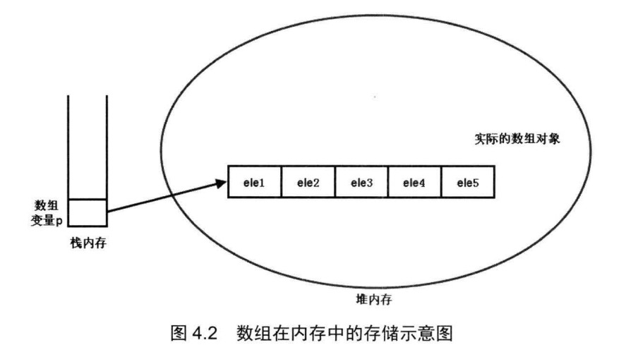

# 流程控制与数组
## 流程控制
### 顺序结构
任何编程语言中最常见的程序结构就是顺序结构，顺序结构就是程序从上到下逐行地执行，中间没有任何判断和跳转
### 分支结构
Java 提供了两种常见的分支控制结构: `if`语句和 `switch` 语句
* `if`语句使用布尔表达式或布尔值作为分支条件来进行分支控制
* `switch`语句则用于对多个整型值进行匹配，从而实现分支控制
#### if条件语句
if语句使用布尔表达式或布尔值作为分支条件来进行分支控制，if语句有以下三种形式
* 第一种
    ```bash
    if (logic expression)
    {
        statement...
    }
    ```
    * 代码示例
        ```bash
        int age = 25;
        if (age > 23) {
            System.out.println("该结婚买房了!");//该结婚买房了!
        }
        ```
* 第二种
    ```bash
    if (logic expression)
    {
        statement...
    }
    else
    {
        statement...
    }
    ```
    * 代码示例
        ```bash
        int age = 21;
        if (age > 23) {
            System.out.println("该结婚买房了!");
        } else {
            System.out.println("年龄还小，要好好努力学习啊!");//年龄还小，要好好努力学习啊!
        }
        ```
* 第三种
    ```bash
    if (logic expression)
    {
        statement...
    }
    else if (logic expression)
    {
        statement...
    }
    ...//可以有0个或多个else if语句
    else//最后的else语句也可以省略
    {
        statement...
    }
    ```
    * 代码示例
        ```bash
        int age = 30;
        if (age == 23) {
            System.out.println("该结婚买房了!");
        }else if (age == 20) {
            System.out.println("原来你才20岁啊，太小了，不过也要好好珍惜啊!");//原来你才20岁啊，太小了，不过也要好好珍惜啊!
        }else if (age == 30){
            ;//一个分号表示空语句，在此处的含义是如果age==30，什么也不做。
        } else {
            System.out.println("年龄还小，要好好努力学习啊!");//年龄还小，要好好努力学习啊!
        }
        ```
##### 注意点
* 上面`if`语句的3种形式中，放在`if`之后括号里的只能是一个逻辑表达式，即这个表达式的返回值只能是`true`或`false`.
* 在使用`if...else`语句时有一条基本规则:总是优先把包含范围小的条件放在前面处理
* 例如`age>60`和`age>20`两个条件，明显`age>60`的范围更小，所以应该先处理`age>60`的情况
#### switch语句
`Java`增强后的`switch`分支语句
* `switch`语句由一个控制表达式和多个`case`标签组成
* 和`if`语句不同的是，`switch`语句后面的控制表达式的数据类型只能是`byte`、`short`、`char`、`int`四种整数类型，`枚举类型`和`java.lang.String`类型(从Java7才允许)，不能是`boolean`类型。
* `switch`语句往往需要在`case`标签后紧跟一个代码块，`case`标签作为这个代码块的标识

`switch`语句的语法格式如下:
```bash
switch (expression)
{
    case condition1:
    {
        statement(s)
        break;
    }
    case condition2:
    {
        statement(s)
        break;
    }
    case conditionN:
    {
        statement(s)
        break;
    }
    default :
    {
        statement(s)
    }
}
```
这种分支语句的执行是先对`expression`求值，然后依次匹配`condition1`、`condition2`、`conditionN`等值,遇到匹配的值即执行对应的执行体;如果所有`case`标签后的值都不与`expression`表达式的值相等,则执行`default`标签后的代码块

代码示例
```bash
int a = 5 * 3;
switch (a) {
    case 2: {
        System.out.printf("5 * 3的结果是：%d", 2);
        break;
    }
    case 5: {
        System.out.printf("5 * 3的结果是：%d", 5);
        break;
    }
    case 15: {
        System.out.printf("5 * 3的结果是：%d", 15);//5 * 3的结果是：15
        break;
    }
    default: {
        System.out.printf("5 * 3的结果是：%d", 10);
    }
}
```
* `Java7`增强了`switch`语句的功能，允许`switch`语句的控制表达式是`java.lang.String`类型的变量或表达式.
* 只能是`java.lang.String`类型，不能是`StringBuffer`或`StringBuilder`这两种字符串类型
代码示例
```bash
String season = "秋天";//我也不知道现在是什么天啊!
//        String season1 = "秋";//我也不知道现在是什么天啊!
switch (season){
    case "春天":
    {
        System.out.println("现在是春天啊!");
        break;
    }
    case "夏天":
    {
        System.out.println("现在是夏天啊!");
        break;
    }
    case "秋天":
    {
        System.out.println("现在是秋天啊!");
        break;//如果不加break将会连着满足当前case的之后条件下的代码块一起打印
        /*
        不加break将会输出：
        现在是秋天啊!
        现在是冬天啊!
         */
    }
    case "冬天":
    {
        System.out.println("现在是冬天啊!");
        break;
    }
    default:{
        System.out.println("我也不知道现在是什么天啊!");
    }
}
```
##### 注意点
使用switch语句时，有两个值得注意的地方 :
* `witch`语句后的`expression`表达式的数据类型只能是`byte`、`short`、`char`、`int`四种整数类型,`String (Java7才支持)`和`枚举类型`
* 第二地方是如果省略了`case`后代码块的`break`，将达不到预期效果
### 循环结构
* 循环语句可以在满足循环条件的情况下，反复执行某一段代码，这段被重复执行的代码被称为循环体。
* 当反复执行这个循环体时，需要在合适的时候把循环条件改为假，从而结束循环，否则循环将一直执行下去，形成死循环。

循环语句可能包含如下4个部分

* 初始化语句`(init statement)`:一条或多条语句，这些语句用于完 成一些初始化工作。初始化句在循环开始之前执行
* 循环条件`(test_expression)`:这是`boolean`表达式，这个表达式能决定是否执行循环体
* 循环体`(body_statement)`:这个部分是循环的主体，如果循环条件允许，这个代码块将被重复执行，如果这个代码块只有一行语句，则这个代码块的花括号是可以省略的
* 迭代语句`(iteration_statement)`:这个部分在一次循环体执行结束后，对循环条件求值之前执行，通常用于控制循环条件中的变量，使得循环在合适的时候结束。

上面4个部分只是一般性的分类，并不是每个循环中都非常清晰地分出了这4个部分。

#### while循环语句
语法格式
```bash
[init_statement]
while(test_expression)
{
    statement;
    [iteration_statement]
}
```
解释
* `while`循环每次执行循环体之前，先对`test_expression`循环条件求值,如果循环条件为`true`，则行循环体部分。
* 迭代语句`iteration_statement`总是位于循环体的最后,循环体能成功执行完成时，`while`循环才会执行`iteration_statement`语句。
* 从这个意义上来看，`while`循环也可被当作条件语句——如果`test_expression`条件一开始就为`false`，则循环体部分将永远不会获得执行。
代码示例
```bash
int count = 1;
while (count <= 10) {
    System.out.println(count);
//            count += 1;//每次循环累加1
    count++;//每次循环累加1
//            ++count;//每次循环累加1
//            System.out.println(count);
}
System.out.println("-----循环结束-----");//11
System.out.println(count);//11
```
如果`while`循环的循环体部分和迭代语句合并在一起，且只有一行代码，则可以省略`while`循环后的花括号。但这种省略花括号的做法，可能降低程序的可读性。

使用`while`循环时，一定要保证循环条件有变成`false`的时候，否则这个循环将成为一个死循环，永远无法结束这个循环。
代码示例
```bash
int count = 5;
while (count < 6) {
    System.out.println(count);
    count--;
}
System.out.println("上边代码已造成了死循环，无法执行当前打印语句!");
```
简单的死循环
```bash
while (true) {
    System.out.println("死循环");
}
```
#### do while循环语句
`do while`循环与`while`循环的区别
* `while`循环是先判断循环条件，如果条件为真则执行循环体。
* `do while`循环则先执行循环体，然后才判断循环条件，如果循环条件为真，则执行下一次循环，否则中止循环。

`do while`循环的语法格式
```bash
[init_statement]
do
{
    statement ;
    [iteration_statement]
}while (test_expression) ;
```
与`while`循环不同的是，`do while`循环的循环条件后必须有一个分号，这个分号表明循环结束。

代码示例
```bash
int count = 1;
do {
//            count++;//2-10
//            ++count;//2-10
    System.out.println(count);
    count++;//1-10
//            ++count;//1-10
} while (count <= 10);
System.out.println("循环结束!");//循环结束!
```
即使`test_expression`循环条件的值开始就是假。`do while`循环也会执行循环体。因此,`do while`循环的循环体至少执行一次。以下为代码验证
```bash
int count = 5;
do {
    System.out.println(count);//打印了一次 5
    count++;
}while (count>10);
```
#### for循环
`for`循环是更加简洁的循环语句，大部分情况下. `for`循环可以代替`while`循环、 `do while`循环

`for`循环的基本语法格式如下:
```bash
for ([init_statement]; [test_expression); [iteration statement])
{
    statement
}
```
* 程序执行for循环时，先执行循环的初始化语句`init_statement`。初始化语句只在循环开始前执行一次。
* 每次执行循环体之前，先计算`test_expression`循环条件的值，如果循环条件返回`true`，则执行循环体，循环体执行结束后执行循环迭代语句 。

因此，对于`for`循环而言，循环条件总比循环体要多执行一次。因为最后一次执行循环条件返回`false`，将不再执行循环体。

值得指出的是，`for`循环的循环迭代语句并没有与循环体放在一起，因此即使在执行循环体时遇到`continue`语句结束本次循环，循环法代语句也一样会得到执行。

`for`循环和`while`、`do while`循环不同之处
* 由于`while`、`do while`循环的循环迭代语句紧跟跟着循环休，因此如果循环体不能完全执行，如使用`continue`语句来结束本次循环，则循环迭代语句不会被执行 。
* 但`for`循环的循环迭代语句并没有与循环体放在一起，因此不管是否使用`continue`语句来结束本次循环，循环迭代语句一样会获得执行。

代码示例
```bash
for (int count = 1; count <= 10; count++){
    System.out.printf("本次循环count的值为%s\n", count);
}
System.out.println("循环结束!");

输出:
本次循环count的值为1
本次循环count的值为2
本次循环count的值为3
本次循环count的值为4
本次循环count的值为5
本次循环count的值为6
本次循环count的值为7
本次循环count的值为8
本次循环count的值为9
本次循环count的值为10
循环结束!
```
`for`循环允许同时指定多个初始化语句，循环条件也可以是一个包含逻辑运算符的表达式。

代码示例
```bash
for (int a = 0, b = 0, c = 0; a < 10 && b < 6 && c < 4; a++, b++, c++) {
    System.out.printf("本次循环a=%d,b=%d,c=%d\n", a, b, c);
}
System.out.println("循环结束!");

输出：
本次循环a=0,b=0,c=0
本次循环a=1,b=1,c=1
本次循环a=2,b=2,c=2
本次循环a=3,b=3,c=3
循环结束!
```
上面代码中初始化变量有3个，但是只能有一个声明语句，因此如果需要在初始化表达式中声明多个变量，那么这些变量应该具有`相同的数据类型`。

建议不要在循环体内修改循环变量(也叫循环计数器)的值，否则会增加程序出错的可能性。

万一程序真的需要访问、修改循环变量的值，建议重新定义一个临时变量，先将循环变量的值赋给临时变量，然后对临时变量的值进行修改。

`for`循环圆括号中只有两个分号是必需的，`初始化语句`、`循环条件`、`迭代语句部分`都是可以省略的。如果省略了循环条件，则这个循环条件默认为`true`，将会产生一个死循环。

例如下面的程序
```bash
for (; ; ) {
    System.out.println("----");
}
```

使用`for`循环时，还可以把`初始化条件`定义在`循环体之外`，把`循环迭代语句`放在`循环体内`,这种做法就非常类似于前面的`while`循环了。

代码示例
```bash
int b = 1;
for (; b <= 100; ) {
    System.out.println(b);
    b++;
}
System.out.println("--------------");
System.out.println(b);//101 for循环外依然可以访问到b
```
* for循环的初始化语句放在循环之前定义还有一个作用，可以扩大初始化语句中所定义变量作用域。
* 在for循环里定义的变量，其作用域仅在该循环内有效，for循环终止之后，这些变量将不可被访问。

如果需要在for循环以外的地方使用这些变量的值，就可以采用上面的做法。

除此之外，还有一种做法也可以满足这种要求：额外定义一个变量来保存这个循环变量的值。

代码示例：
```bash
int tmp = 0;
for (int j = 1; j <= 10; j++) {
    tmp = j;
    System.out.printf("j=%d\n", j);
}
System.out.printf("tmp=%d\n", tmp);//tmp=10
```
* 相比前面的代码，通常更愿意选择这种解决方案。使用一个变量`tmp`来保存循环变量的值，使得程序更加清晰，变量`j`和变量`tmp`的责任更加清晰。
* 反之，如果采用前一种方法，则变量`j`的作用域被扩大了，功能也被扩大了。
* 作用域扩大的后果是:如果该方法还有另一个循环也需要定义循环变量，不能再次使用`j`作为循环变量。

几个小例子

* 打印1-100内的所有偶数
    ```bash
    System.out.println("--------------");
    int a = 1;
    for (; a <= 100; a++) {
        if (a % 2 == 0) {
            System.out.println(a);
        }
    }
    ```
* 计算1-100的和
    ```bash
    System.out.println("--------------");
    int numCount = 0;
    for (int i = 1; i <= 100; i++) {
        numCount += i;
    }
    //        System.out.println(i);//编译报错，因为i是在for循环内定义的，所以i的作用域在for循环内有效。
    System.out.printf("1-100累加的和为%d", numCount);//1-100累加的和为5050
    ```
#### 嵌套循环
如果把一个循环放在另一个循环体内，那么就可以形成嵌套循环。嵌套循环既可以是for循环嵌套while循环，也可以是while循环嵌套 do while循环…… 即各种类型的循环都可以作为外层循环，也可以作为内层循环。

嵌套循环流程如下图


从图4.1来看，嵌套循环就是把内层循环当成外层循环的循环体。当只有内层循环的循环条件为false时，才会完全跳出内层循环，才可以结束外层循环的当次循环，开始下一次循环。

代码示例
```bash
//外层循环
for (int i = 1; i <= 3; i++) {
    //内层循环
    for (int j = 1; j <= 3; j++) {
        System.out.printf("%d * %d = %d\n", i, j, i * j);
    }
}
```
输出
```bash
1 * 1 = 1
1 * 2 = 2
1 * 3 = 3
2 * 1 = 2
2 * 2 = 4
2 * 3 = 6
3 * 1 = 3
3 * 2 = 6
3 * 3 = 9
```
### 控制循环结构
Java语言没有提供goto语句来控制程序的跳转，这种做法提高了程序流程控制的可读性，但降低了程序流程控制的灵活性。

为了弥补这种不足Java提供了continue、break来控制循环结构,除此之外，return可以结束整个方法，当然也就结束了一次循环。
#### 使用break结束循环
break 用于完全结束一个循环，跳出循环体。

不管是哪种循环，一旦在循环体中遇到break，系统将完全结束该循环，开始执行循环之后的代码。

代码示例(break实现 打印1-5中的1-4)
```bash
for (int i = 1; i <= 5; i++) {
    if (i % 5 == 0) {
        break;
    }
    System.out.println(i);
}
```
输出
```bash
1
2
3
4
```
break语句不仅可以结束其所在的循环,还可以直接结束其外层循环。
* 此时需要在break后紧跟一个标签，这个标签用于标识一个外层循环。
* Java中的标签就是一个紧跟着英文冒号(:)的标识符。
* 与其他语言不同的是， Java中的标签只有放在循环语句之前才有作用。

代码示例
```bash
outer://外层循环，outer作为标识符
for (int i = 1; i <= 3; i++) {
    //内层循环
    for (int j = 1; j <= 3; j++) {
        if (i * j == 6) {
            break outer;//跳出 outer 标签所标识的循环
        }
        System.out.printf("%d * %d = %d\n", i, j, i * j);
    }
}
```
输出
```bash
1 * 1 = 1
1 * 2 = 2
1 * 3 = 3
2 * 1 = 2
2 * 2 = 4
```
#### 使用`continue`忽略本次循环
continue和break的区别
* continue只是忽略本次循环剩下语句，接着开始下循环，并不会终止循环。
* 而break则是完全终止循环本身。

代码示例
```bash
for (int i = 1; i <= 10; i++) {
    if (i % 2 != 0) {
        continue;
    }
    System.out.println(i);
}
```
`for`打印1-10中的偶数
```bash
for (int i = 1; i <= 10; i++) {
    if (i % 2 != 0) {
        continue;
    }
    System.out.println(i);
}
for (int i = 1; i <= 10; i++) {
    if (i % 2 == 0) {
        System.out.println(i);
    }
}
```
`while`打印1-10中的偶数
```bash
int i = 1;
while (i <= 10) {
    if (i % 2 == 0) {
        System.out.println(i);
    }
    i++;
}
```
`do while`打印1-10中的偶数
```bash
int i = 1;
do {
    i++;
    if (i % 2 == 0) {
        System.out.println(i);
    }
} while (i <= 10);
```
与break类似的是，continue后也可以紧跟一个标签，用于直接跳过标签所标识循环的当次循环的剩下语句，重新开始下一次循环。

代码示例
```bash
outer:
for (int i = 1; i <= 3; i++) {
    for (int j = 1; j <= 3; j++) {
        if (j == 2) {
            continue outer;
        }
        System.out.println("i的值是：" + i + "， j的值为：" + j);
    }
}
```
输出
```bash
i的值是：1， j的值为：1
i的值是：2， j的值为：1
i的值是：3， j的值为：1
```
每当j等于2时， continue outer;语句就结束了外层循环的当次循环，直接开始下一次循环，内层循环没有机会执行完成。

#### 使用`return`结束方法
* return关键宇并不是专门用于结束循环的，return的功能是结束一个方法。
* 一个方法执行到return语句时(return关键宇后还可以跟变量、常量和表达式，这将在方法介绍中有更详细的解释)，这个方法将被结束。
* Java程序中大部分循环都被放在方法中执行，例如前面介绍的所有循环示范程序(都是放在main方法中执行的)。
* 一旦在循环体执行到return语句，return语句就会结束该方法，循环自然就随之结束。

代码示例
```bash
for (int i = 0; i <= 3; i++) {
    System.out.println("i的值为：" + i);
    if (i == 1) {
        return;
    }
    System.out.println("本次循环结束!");
}
```
输出
```bash
i的值为：0
本次循环结束!
i的值为：1
```
* 运行上面程序，循环只能执行到i等于1时，当i=1时程序将完全结束(当main方法结束时，就是Java程序结束时)。
* 从这个运行结果来看，虽然return并不是专门用于循环结构控制的关键字，但通过return语句确实可以结束一个循环。
* 与continue和break不同的是,return直接结束整个方法,不管这个return处于多少层循环之内。
### 数组
数组是编程语语中最常见的一种数据结构，可用于存储多个数据，每个数组元素存放一个数据，通常可通过数组元素的索引来访问数组元素，包括为数组元素赋值和取出数组元素的值。
#### 数组也是一种类型
Java中的数组要求所有的数组元素具有相同的数据类型。因此，一个数组中，数组元素的类型是唯一的，即一个数组里只能存储一种数据类型的数据，而不能存储多种数据类型的数据。

因为Java语言是面向对象的语言，而类与类之间可以支持继承关系，这样能产一个数组中可以存放多种数据类型的假象。

例如一个水果数组，要求每个数纽元素都是水果，实际上数组元素既可以是苹果，也可以是香蕉(苹果、香蕉都继承了水果，都是一种特殊的和水果)。但这个数组的数组元素的类型还是唯一的，只能是水果类型。

一旦数组的初始化完 ，数组在内存中所占的空间将被固定下来，因此数组的长度将不可改变。即使把某个数组元素的数据清空，但它所占的空间依然被保留，依然属于该数组，数组的长度依然不变。

Java的数组既可以存储基本类型的数据，也可以存储引用类型的数据，只要所有的数组元素具有相同的类型即可。

值得指出的是，数组也是一种数据类型，它本身是一种引用类型，例如int是一个基本类型，`int[]`(这是定义数组的一种方式)就是一种引用类型了。

#### 定义数组
两种定义数组组方法
1. `type[] arrayName`
2. `type arrayName []`

推荐使用第一种格式来定义数组。第一种不仅拥有更好的语义，而且具有更好的可读性。

Java的模仿者C#不再支持`type arrayName[]`这种语法，它只支持第一种定义教组的语法。越来越多的语言不再支持`type arrayName[]`这种数纽定义语法。

数组是一种引用类型的变量，因此使用它定义一个变量时，仅仅表示定义了一个引用变量(也就是定义了一个指针)，这个引用变量还未指向任何有效的内存。因此定义数组时不能指定数组的长度。

而且由于定义数组只是定义了一个引用变量，并未指向任何有效的内存空间，所以还没有内存空间来存储数组元素，因此这个数组也不能使用，只有对数组进行初始化后才可以使用。

#### 数组的初始化
Java语言中数组必须先初始化，然后才可以使用。所谓初始化，就是为数组的数组元素分配内存空间，并为每个数组元素赋初始值。

数组初始化方法
1. 静态初始化：初始化时由程序员显式指定每个数组元素的初始值，由系统决定数组长度。
2. 动态初始化：初始化时程序员只指定数组长度，由系统为数组元素分配初始值。

##### 静态初始化语法
`arrayName = new type[] {element1 , element2 , element3 , element4 .. . }`

在上面的语法格式中，前面的type就是数组元素的数据类型，此处的type必须与定义数组变量时所使用的type相同，也可以是定义数组时所指定的type的子类，并使用花括号把所有的数组元素括起来，多个数组元素之间以英文逗号`,`隔开，定义初始化值的花括号紧跟在`[]`之后。

值得指出的是，执行静态初始化时，显式指定的数组元素值的类型必须与new关键字后的type类型相同，或者是其子类的实例。

代码示例
```bash
System.out.println("定义数组类型");
//定义一个int数组类型的变量，变量名为array1
int[] array1;
//静态初始化，初始化数组时只指定数组元素的初始值，不指定数组长度。
array1 = new int[]{14, 34, 2, 6};
//打印输出数组的长度
System.out.println(array1.length);
Object[] objArr;
//使用静态初始化 初始化数组时数组元素的类型是定义数组时所指定的数组元素类型的子类.
//String 类型是 Object 类型的子类，即 符串是 种特殊的 Object 实例
objArr = new String[]{"哈哈哈", "啦啦啦"};
System.out.println(objArr.length);
```
静态初始化数组简化写法(**只有在定义数组的 同时执行数组初始化才支持使用简化的静态初始化**)

`type[] arrayName = {elementl , element2 , element3 , element4...}`

在实际开发过程中，可能更习惯将数组定义和数组初始化同时完成，

代码示例
```bash
//数组定义和数组初始化同时完成
///数组的定义和初始化同时完成，使用简化的静态初始化写法
char [] array2 = {'中', '国', '伟', '大'};
System.out.println(array2.length);
```
##### 动态初始化语法
动态初始化只指定数组的长度，由系统为每个数组元素指定初始值。动态初始化的语法格式：`arrayName = new type[length];`

数组的定义和初始化同时完成，使用动态初始化语法

代码示例
```bash
int[] array3 = new int[3];
System.out.println(array3[0]);
System.out.println(array3[1]);
System.out.println(array3[2]);
//会抛出数组下标越界异常，因为数组array3的长度为3，array3[3]是取得第四个元素，第四个元素不存在，就会报错并抛出异常。
//System.out.println(array3[3]);
//数组的定义和初始化同时完成，初始 数组时元素的类型是定义数组时元素类型的子类
Object[] array4 = new String[3];
System.out.println(array4[0]);
System.out.println(array4[1]);
System.out.println(array4[2]);
```
输出
```bash
0
0
0
null
null
null
```
执行动态初始化时，程序员只需指定数组的长度,即为每一数组元素指定所需的内存空间，系统将负责为这些数组元素分配初始值。

指定初始值时，系统按如下规则分配初始值：
```bash
数组元素的类型是基本类型中的整数类型(byte、short、int、long)，则数组元素的值是0
数组元素的类型是基本类型中的浮点类型(float、double)数组元素的值是0.0
数组元素的类型是基本类型中的字符类型(char)，则数组元素的值是'\\uOOOO'
数组元素的类型是基本类型中的布尔类型(boolean)数组元素的值是false
数组元素的类型是引用类型(类、接口和数组) ，则数组元素的值是null
```
不要同时使用静态初始化和动态初始化，也就是说，不要在进行数纽初始化时，既指定数组的长度，也为每个数组元素分配初始值。

数组初始化完成后，就可以使用数组了，包括为数组元素赋值，访问数组元素值和获得数组长度等。

#### 使用数组
数组的索引是从0开始的

##### 数组的声明和取值
```bash
//数组的声明
Object[] array1 = {"阿斯蒂芬", "asdf", "国防部", "dfs45"};
//数组的赋值
array1[0] = 1.5;
//数组的取值
System.out.println(array1[0]);//1.5
System.out.println(array1[1]);//asdf
System.out.println(array1[2]);//国防部
System.out.println(array1[3]);//dfs45
//数组越界异常：java.lang.ArrayIndexOutOfBoundsException: 4
//        System.out.println(array1[4]);//dfs45
System.out.println(array1.length);//4
for (int i = 0; i < array1.length; i++) {
    System.out.println(array1[i]);
}
/*
 输出:
 阿斯蒂芬
 asdf
 国防部
 dfs45
 */
String[] books = new String[3];
books[0] = "疯狂Java讲义";
books[1] = "疯狂Python讲义";
for (int j = 0; j < books.length; j++) {
    System.out.println(books[j]);
}
/*
 输出
 疯狂Java讲义
 疯狂Python讲义
 null
 */
```
##### foreach循环
* 使用foreach循环遍历数组和集合元素时，无须获得数组和集合长度，无须根据索引来访问数组元素和集合元素，foreach循环自动遍历数组和集合的每个元素。
* 语法
    ```bash
    for (type variableName : array | collection){
      // variableName自动态代访问每个元素...
    }
    type是数组元素或集合元素的类型，variableName是一个形参名，foreach循环将自动将数组元素、集合元素依次赋给该变量.
    ```

代码示例
```bash
Object[] array1 = {"阿斯蒂芬", "asdf", "国防部", "dfs45"};
for (Object varObj : array1
) {
    System.out.println(varObj);
}
/*
输出：
阿斯蒂芬
asdf
国防部
dfs45
 */
```

使用foreach循环来法代输出数组元素或集合元素时，通常不要对循环变量进行赋值，虽然这种赋值在语法上是允许的，但没有太大的实际意义， 且极容易引起错误。

代码示例
```bash
Object[] array1 = {"阿斯蒂芬", "asdf", "国防部", "dfs45"};
for (Object var : array1
) {
    var = "哈哈";
    System.out.println(var);
}
System.out.println(array1[0]);
/*
输出：
哈哈
哈哈
哈哈
哈哈
阿斯蒂芬
 */
```
* 使用foreach循环迭代数组元素时，并不能改变数组元素的值，因此不要对foreach的循环变量进行赋值。
* 当使用foreach来迭代数组元素时，foreach中的循环变量相当于一个临时变量。
* 系统会把数组元素依次赋给这个临时变量，而这个临时变量并不是数组元素。
* 它只是保存了数组元素的值。因此，如果希望改变数组元素，则不能使用这种foreach循环。

#### 深入数组
数组是一种引用数据类型，数组引用变量只是一个引用，数组元素和数组变量在内存里是分开存放的。
##### 内存中的数组
数组引用变量只是一个引用，这个引用变量可以指向任何有效的内存，只有当该引用指向有效内存后，才可通过该数组变量来访问数组元素。

实际的数组对象被存储在堆(heap)内存中;如果引用该数组对象的数组引用变量是一个局部变量，那么它被存储在栈(stack)内存中。

如果需要访问如图4.2所示堆内存中的数组元素，则程序中只能通过`p[index]`的形式实现。也就是说，数组引用变量是访问堆内存中数组元素的根本方式。

* 如果堆内存中数组不再有任何引用变量指向自己，则这个数组将成为垃圾，该数组所占的内存将会被系统的垃圾回收机制回收。
* 因此，为了让垃圾回收机制回收一个数组所占的内存空间，可以将该数组变量赋为null，也就切断了数组引用变量和实际数组之间的引用关系，实际的数组也就成了垃圾。

##### 二维数组
代码示例
```bash
//动态初始化
Object[][] arr = new String[3][2];
System.out.println("arr.length:" + arr.length);//输出行数 3
System.out.println(arr[0].length);//输出列数 2
System.out.println(arr[1].length);//输出列数 2
System.out.println(arr[2].length);//输出列数 2
//        System.out.println(arr[3].length);//输出列数 java.lang.ArrayIndexOutOfBoundsException: 3
//静态初始化
int[][] intA = {{1, 2, 5, 2}, {2, 3}, {3, 4, 5}};
System.out.println("intA.length:" + intA.length);//输出行数
System.out.println(intA[0].length);//输出列数 4
System.out.println(intA[1].length);//输出列数 2
System.out.println(intA[2].length);//输出列数 3
输出：
arr.length:3
2
2
2
intA.length:3
4
2
3
 */
```
#### Java8增强的工具类:Arrays
Arrays类处于`java.util`包下，为了在程序中使用`Arrays`类，必须在程序中导入`java.util.Arrays`类

Java提供的Arrays类里包含的一些static修饰的方法可以直接操作数组。方法如下
1. **`int binarySearch(type[] a, type key)`**
    * 使用二分法查询key元素值在a数组中出现的索引。
    * 如果a数组不包含key元素值，则返回负数。
    * 调用该方法时要求数组中元素己经按升序排列,这样才能得到正确结果。
2. **`int binarySearch(type[] a, int fromIndex, int toIndex, type key)`**
    * 这个方法与前一个方法类似，但它只搜索a数组中fromIndex到toIndex索引的元素。
    * 调用该方法时要求数组中元素己经按升序排列，这样才能得到正确结果。
3. **`type[] copyOf(type[] original, int length)`**
    * 这个方法将会把original数组复制成一个新数组，其中length是新数组的长度。
    * 如果length小于original数组的长度，则新数组就是原数组的前面length个元素。
    * 如果length大于original数组的长度，则新数组的前面元素就是原数组的所有元素，后面补充0(数值类型)、false(布尔类型)或者null(引用类型)
4. **`type[] copyOfRange(type[] original, int fromIndex, int toIndex)`**
    * 这个方法与前面方法相似，但这个方法只复制original数组的from索引到to索引的元素。
5. **`boolean equals(type[] a, type[] a2)`**
    * 如果a数组和a2数组的长度相等，而且a数组和a2数组的数组元素也一一相同，该方法将返回true
6. **`void fill(type[] a, type val)`**
    * 该方法将会把a数组的所有元素都赋值为val
7. **`void fill(type[] a, int fromIndex, int toIndex, type val)`**
    * 该方法与前一个方法的作用相同，区别只是该方法仅仅将a数组的fromIndex到toIndex索引的数组元素赋值为val。
8. **`void sort(type[] a)`**
    * 该方法对a数组的数组元素进行排序。
9. **`void sort(type[] a, int fromIndex, int toIndex)`**
    * 该方法与前一个方法相似,区别是该方法仅仅对fromIndex到toIndex索引的元素进行排序。
10. **`String toString(type[] a)`**
    * 该方法将一个数组转换成一个字符串。该方法按顺序将多个数组元素连缀在一起，多个数组元素使用英文逗号`,`和空格隔开。

代码示例
```java
package com.abc.part_three;

import java.util.Arrays;

public class ArraysTest {
    public static void main(String[] args) {
        int[] a = new int[]{4, 5, 6, 7};
        int[] a1 = new int[]{4, 5, 6, 7};
        int[] c = {43, 5, 6, 567, 68, 456, 9609, 34, 2, 4};
        int[] d = {43, 5, 6, 567, 68, 456, 9609, 34, 2, 4};
        /**
         * 返回值为boolean类型
         * Arrays.equals(type[] a, type[] a2)
         */
        System.out.println("a数组和a1数组是否相等：" + Arrays.equals(a, a1));//a数组和a1数组是否相等：true
        /**
         * 都有返回值，返回一个新数组
         * Arrays.copyOf(type[] original, int length)
         * Arrays.copyOfRange(type[] original, int fromIndex, int toIndex)
         */
        System.out.println("******************************************************");
        int[] b = Arrays.copyOf(a, 7);//7大于数组a的长度,因为数组b是int类型数组,所以从数组b第5个元素开始往后都为0，补充3个0，此时数组b的长度为7
        //Arrays.toString(b)：该方法将数组转b换成一个字符串。
        System.out.println("数组b：" + Arrays.toString(b));//数组b：[4, 5, 6, 7, 0, 0, 0]
        int[] b1 = Arrays.copyOfRange(b, 1, 5);//左开右闭，包含数组b中的索引为1的元素，不包含数组b中的索引为5的元素
        System.out.println("数组b1：" + Arrays.toString(b1));//数组b1：[5, 6, 7, 0]
        /**
         * 没有返回值，直接在原数组上进行修改。
         * Arrays.fill(type[] a, type val)
         * Arrays.fill(type[] a, int fromIndex, int toIndex, type val)
         */
        System.out.println("******************************************************");
        Arrays.fill(a1, 6);
        System.out.println("数组a1：" + Arrays.toString(a1));//数组a1：[6, 6, 6, 6]
        Arrays.fill(a1, 's');//将char类型自动转换为int类型的115,然后把a1数组的所有元素都赋值为val
        System.out.println("(char) 115 = " + (char) 115);//int类型的115强制转换为char类型：(char) 115 = s
        System.out.println("数组a1：" + Arrays.toString(a1));//数组a1：[115, 115, 115, 115]
        Arrays.fill(a, 1, 3, 6);//左开右闭，包含数组b中的索引为1的元素，不包含数组b中的索引为3的元素
        /**
         * 没有返回值，直接在原数组上进行排序。
         * Arrays.sort(type[] a)
         * Arrays.sort(type[] a, int fromIndex, int toIndex)
         */
        System.out.println("******************************************************");
        System.out.println("数组a：" + Arrays.toString(a));//数组a：[4, 6, 6, 7]
        Arrays.sort(c);
        System.out.println("数组c从小到大排序后为：" + Arrays.toString(c));//数组c从小到大排序后为：[2, 4, 5, 6, 34, 43, 68, 456, 567, 9609]
        Arrays.sort(d, 4, 8);//实际上是对68, 456, 9609, 34这四个数字从小到大排序后再放回数组d中对应索引位置
        System.out.println("把数组d中索引4(包含索引4)-8(不包含索引8)的元素从小到大排序后为：" + Arrays.toString(d));//把数组d中索引4(包含索引4)-8(不包含索引8)的元素从小到大排序后为：[43, 5, 6, 567, 34, 68, 456, 9609, 2, 4]
        /**
         *
         * Arrays.binarySearch(type[] a, type key)
         * Arrays.binarySearch(type[] a, int fromIndex, int toIndex, type key)
         */
        System.out.println("******************************************************");
        System.out.println("数组c：" + Arrays.toString(c));//数组c：[2, 4, 5, 6, 34, 43, 68, 456, 567, 9609]
        //返回34在数组c中的索引
        int index34 = Arrays.binarySearch(c, 34);
        System.out.println("34在数组c中的索引位置为：" + index34);//34在数组c中的索引位置为：4
        //数组c不包含99999，返回负数。
        int indexElementNotFound = Arrays.binarySearch(c, 99999);
        System.out.println("99999在数组c中不存在，返回负数：" + indexElementNotFound);//99999在数组c中不存在，返回负数：-11
        //返回数组c中索引2(包含)——索引8(不包含)，也就是(5, 6, 34, 43, 68, 456)中的68在数组c中的索引
        int indexIndexInterval = Arrays.binarySearch(c, 2, 8, 68);
        System.out.println("数组c中索引2(包含)——索引8(不包含)，也就是(5, 6, 34, 43, 68, 456)中的68在数组c中的索引位置为：" + indexIndexInterval);//数组c中索引2(包含)——索引8(不包含)，也就是(5, 6, 34, 43, 68, 456)中的68在数组c中的索引位置为：6
        //567不在数组c中索引2(包含)——索引8(不包含)，也就是说567不在(5, 6, 34, 43, 68, 456)中，返回负数
        int indexElementNotFoundNotInIndexInterval = Arrays.binarySearch(c, 2, 8, 567);
        System.out.println("567不在数组c中索引2(包含)——索引8(不包含)，也就是说567不在(5, 6, 34, 43, 68, 456)中，返回负数：" + indexElementNotFoundNotInIndexInterval);//567不在数组c中索引2(包含)——索引8(不包含)，也就是说567不在(5, 6, 34, 43, 68, 456)中，返回负数：-9
    }
}
```
程序执行结果
```bash
a数组和a1数组是否相等：true
******************************************************
数组b：[4, 5, 6, 7, 0, 0, 0]
数组b1：[5, 6, 7, 0]
******************************************************
数组a1：[6, 6, 6, 6]
(char) 115 = s
数组a1：[115, 115, 115, 115]
******************************************************
数组a：[4, 6, 6, 7]
数组c从小到大排序后为：[2, 4, 5, 6, 34, 43, 68, 456, 567, 9609]
把数组d中索引4(包含索引4)-8(不包含索引8)的元素从小到大排序后为：[43, 5, 6, 567, 34, 68, 456, 9609, 2, 4]
******************************************************
数组c：[2, 4, 5, 6, 34, 43, 68, 456, 567, 9609]
34在数组c中的索引位置为：4
99999在数组c中不存在，返回负数：-11
数组c中索引2(包含)——索引8(不包含)，也就是(5, 6, 34, 43, 68, 456)中的68在数组c中的索引位置为：6
567不在数组c中索引2(包含)——索引8(不包含)，也就是说567不在(5, 6, 34, 43, 68, 456)中，返回负数：-9
```
Java 8增强了Arrays类的功能，为Arrays类增加了一些工具方法，这些工具方法可以充分利用多CPU并行的能力来提高设值、排序的性能。

下面是Java 8为Arrays类增加的工具方法
1. **`void parallelPrefix(xxx[] array, XxxBinaryOperator op)`**
    * 该方法使用op参数指定的计算公式计算得到的结果作为新的元素。
    * op计算公式包括left和right两个形参，其中left代表数组中前一个索引处的元素，right代表数组中当前索引处的元素，当计算第一个新数组元素时，left的值默认为1。
2. **`void parallelPrefix(xxx[] array， int fromIndex, int toIndex, XxxBinaryOperator op)`**
    * 该方法与上一个方法相似，区别是该方法仅重新计算fromIndex到toIndex索引的元素。
3. **`void setAll(xxx[] array, IntToXxxFunction generator)`**
    * 该方法使用指定的生成器(generator)为所有数组元素设置值,该生成器控制数组元素的值的生成算法。
4. **`void parallelSetAll(xxx[] array, IntToXxxFunction generator)`**
    * 该方法的功能与上一个方法相同，只是该方法增加了并行能力，可以利用多CPU并行来提高性能。
5. **`void parallelSort(xxx[] a)`**
    * 该方法的功能与Arrays类以前就有的sort()方法相似，只是该方法增加了并行能力，可以利用多CPU并行来提高性能。
6. **`void parallelSort(xxx[] a, int fromIndex,  int toIndex)`**
    * 该方法与上一个方法相似，区别是该方法仅对fromIndex到toIndex索引的元素进行排序。
7. **`Spliterator.OfXxx spliterator(xxx[] array)`**
    * 将该数组的所有元素转换成对应的Spliterator对象。
8. **`Spliterator.OfXxx spliterator(xxx[] array, int startInclusive, int endExclusive)`**
    * 该方法与上一个方法相似，区别是该方法仅转换startInclusive到endExclusive索引的元素。
9. **`XxxStream stream(xxx[] array)`**
    * 该方法将数组转换为Stream，Stream是Java 8新增的流式编程的API
10. **`XxxStream stream(xxx[] array, int startInclusive, int endExclusive)`**
    * 该方法与上一个方法相似，区别是该方法仅将startInclusive到endExclusive索引的元素转换为Stream。

**上面方法列表中，所有以parallel开头的方法都表示该方法可利用CPU并行的能力来提高性能。**

**上面方法中的xxx代表不同的数据类型，比如处理int[]型数组时应将xxx换成int，处理long[]型数组时应xxx换成long。**

代码示例
```java
package com.abc.part_three;

import java.util.Arrays;

public class ArraysTest {
    public static void main(String[] args) {
        int[] arr = {3, -4, 25, 16, 30, 18};
        Arrays.parallelSort(arr);//调用了parallelSort()方法对数组arr执行排序，该方法的功能与传统sort()方法大致相似，只是在多CPU机器上会有更好的性能。
        System.out.println("对数组arr进行并发排序：" + Arrays.toString(arr));//对数组arr进行并发排序：[-4, 3, 16, 18, 25, 30]

        int[] arr2 = new int[10];
        int[] arr5 = {2, 1, 3, 12, -2, 7};
        Arrays.fill(arr2, 1);
        System.out.println("arr2进行运算前:" + Arrays.toString(arr2));//arr2进行运算前:[1, 1, 1, 1, 1, 1, 1, 1, 1, 1]
        System.out.println("arr5进行运算前:" + Arrays.toString(arr5));//arr5进行运算前:[2, 1, 3, 12, -2, 7]
        //parallelPrefix方法用用户提供的二进制操作符对给定数组中的每个元素进行累积计算。
        Arrays.parallelPrefix(arr2, (x, y) -> x + y);
        Arrays.parallelPrefix(arr5, (m, n) -> m + n);
        System.out.println("arr2进行运算后:" + Arrays.toString(arr2));//arr2进行运算后:[1, 2, 3, 4, 5, 6, 7, 8, 9, 10]
        System.out.println("arr5进行运算后:" + Arrays.toString(arr5));//arr5进行运算后:[2, 3, 6, 18, 16, 23]
        /**
         * 解析执行了`Arrays.parallelPrefix(arr5, (m, n) -> m + n);`语句后，数组arr5的变化过程：
         * 1.首先，从数组arr5的索引为1的元素开始进行运算，索引为1=1，此时1(索引为1)加上当前索引元素的前一个索引的元素也就是2，计算结果为3。
         * 然后再将计算结果3赋值给数组arr5索引为1的元素，这个过程中数组arr5的值已经被修改了，由[2, 1, 3, 12, -2, 7]——>[2, 3, 3, 12, -2, 7]。
         * 2.然后在从数组arr5索引为2的元素开始往下执行，此时3(索引为2)加上当前索引元素的前一个索引的元素也就是3(被修改后的arr5数组中[2, 3, 3, 12, -2, 7]索引为1的元素)，计算结果为6。
         * 然后再将计算结果6赋值给被修改后的arr5数组中索引为2的元素，这个过程中数组arr5的值已经被修改了，由[2, 3, 3, 12, -2, 7]——>[2, 3, 6, 12, -2, 7]。
         * 3.再往下执行与上边执行过程同理。
         */
        int[] arr3 = new int[10];
        //Arrays.setAll(arr3, i -> i * 10);//setAll方法提供一个 int -> T的函数接口，通过该接口对数组的索引进行操作，然后将指定数组当前索引位置的值赋值为操作后的值
        Arrays.parallelSetAll(arr3, j -> j * 10);//parallelSetAll方法是 setAll的并行操作版本。
        System.out.println("arr3:" + Arrays.toString(arr3));//arr3:[0, 10, 20, 30, 40, 50, 60, 70, 80, 90]
    }
}
```
程序执行输出结果
```bash
对数组arr进行并发排序：[-4, 3, 16, 18, 25, 30]
arr2进行运算前:[1, 1, 1, 1, 1, 1, 1, 1, 1, 1]
arr5进行运算前:[2, 1, 3, 12, -2, 7]
arr2进行运算后:[1, 2, 3, 4, 5, 6, 7, 8, 9, 10]
arr5进行运算后:[2, 3, 6, 18, 16, 23]
arr3:[0, 10, 20, 30, 40, 50, 60, 70, 80, 90]
```