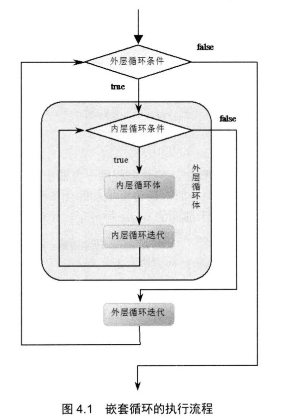

# 流程控制与数组
## 流程控制
### 顺序结构
任何编程语言中最常见的程序结构就是顺序结构，顺序结构就是程序从上到下逐行地执行，中间没有任何判断和跳转
### 分支结构
Java 提供了两种常见的分支控制结构: `if`语句和 `switch` 语句
* `if`语句使用布尔表达式或布尔值作为分支条件来进行分支控制
* `switch`语句则用于对多个整型值进行匹配，从而实现分支控制
#### if条件语句
if语句使用布尔表达式或布尔值作为分支条件来进行分支控制，if语句有以下三种形式
* 第一种
    ```bash
    if (logic expression)
    {
        statement...
    }
    ```
    * 代码示例
        ```bash
        int age = 25;
        if (age > 23) {
            System.out.println("该结婚买房了!");//该结婚买房了!
        }
        ```
* 第二种
    ```bash
    if (logic expression)
    {
        statement...
    }
    else
    {
        statement...
    }
    ```
    * 代码示例
        ```bash
        int age = 21;
        if (age > 23) {
            System.out.println("该结婚买房了!");
        } else {
            System.out.println("年龄还小，要好好努力学习啊!");//年龄还小，要好好努力学习啊!
        }
        ```
* 第三种
    ```bash
    if (logic expression)
    {
        statement...
    }
    else if (logic expression)
    {
        statement...
    }
    ...//可以有0个或多个else if语句
    else//最后的else语句也可以省略
    {
        statement...
    }
    ```
    * 代码示例
        ```bash
        int age = 30;
        if (age == 23) {
            System.out.println("该结婚买房了!");
        }else if (age == 20) {
            System.out.println("原来你才20岁啊，太小了，不过也要好好珍惜啊!");//原来你才20岁啊，太小了，不过也要好好珍惜啊!
        }else if (age == 30){
            ;//一个分号表示空语句，在此处的含义是如果age==30，什么也不做。
        } else {
            System.out.println("年龄还小，要好好努力学习啊!");//年龄还小，要好好努力学习啊!
        }
        ```
##### 注意点
* 上面`if`语句的3种形式中，放在`if`之后括号里的只能是一个逻辑表达式，即这个表达式的返回值只能是`true`或`false`.
* 在使用`if...else`语句时有一条基本规则:总是优先把包含范围小的条件放在前面处理
* 例如`age>60`和`age>20`两个条件，明显`age>60`的范围更小，所以应该先处理`age>60`的情况
#### switch语句
`Java`增强后的`switch`分支语句
* `switch`语句由一个控制表达式和多个`case`标签组成
* 和`if`语句不同的是，`switch`语句后面的控制表达式的数据类型只能是`byte`、`short`、`char`、`int`四种整数类型，`枚举类型`和`java.lang.String`类型(从Java7才允许)，不能是`boolean`类型。
* `switch`语句往往需要在`case`标签后紧跟一个代码块，`case`标签作为这个代码块的标识

`switch`语句的语法格式如下:
```bash
switch (expression)
{
    case condition1:
    {
        statement(s)
        break;
    }
    case condition2:
    {
        statement(s)
        break;
    }
    case conditionN:
    {
        statement(s)
        break;
    }
    default :
    {
        statement(s)
    }
}
```
这种分支语句的执行是先对`expression`求值，然后依次匹配`condition1`、`condition2`、`conditionN`等值,遇到匹配的值即执行对应的执行体;如果所有`case`标签后的值都不与`expression`表达式的值相等,则执行`default`标签后的代码块

代码示例
```bash
int a = 5 * 3;
switch (a) {
    case 2: {
        System.out.printf("5 * 3的结果是：%d", 2);
        break;
    }
    case 5: {
        System.out.printf("5 * 3的结果是：%d", 5);
        break;
    }
    case 15: {
        System.out.printf("5 * 3的结果是：%d", 15);//5 * 3的结果是：15
        break;
    }
    default: {
        System.out.printf("5 * 3的结果是：%d", 10);
    }
}
```
* `Java7`增强了`switch`语句的功能，允许`switch`语句的控制表达式是`java.lang.String`类型的变量或表达式.
* 只能是`java.lang.String`类型，不能是`StringBuffer`或`StringBuilder`这两种字符串类型
代码示例
```bash
String season = "秋天";//我也不知道现在是什么天啊!
//        String season1 = "秋";//我也不知道现在是什么天啊!
switch (season){
    case "春天":
    {
        System.out.println("现在是春天啊!");
        break;
    }
    case "夏天":
    {
        System.out.println("现在是夏天啊!");
        break;
    }
    case "秋天":
    {
        System.out.println("现在是秋天啊!");
        break;//如果不加break将会连着满足当前case的之后条件下的代码块一起打印
        /*
        不加break将会输出：
        现在是秋天啊!
        现在是冬天啊!
         */
    }
    case "冬天":
    {
        System.out.println("现在是冬天啊!");
        break;
    }
    default:{
        System.out.println("我也不知道现在是什么天啊!");
    }
}
```
##### 注意点
使用switch语句时，有两个值得注意的地方 :
* `witch`语句后的`expression`表达式的数据类型只能是`byte`、`short`、`char`、`int`四种整数类型,`String (Java7才支持)`和`枚举类型`
* 第二地方是如果省略了`case`后代码块的`break`，将达不到预期效果
### 循环结构
* 循环语句可以在满足循环条件的情况下，反复执行某一段代码，这段被重复执行的代码被称为循环体。
* 当反复执行这个循环体时，需要在合适的时候把循环条件改为假，从而结束循环，否则循环将一直执行下去，形成死循环。

循环语句可能包含如下4个部分

* 初始化语句`(init statement)`:一条或多条语句，这些语句用于完 成一些初始化工作。初始化句在循环开始之前执行
* 循环条件`(test_expression)`:这是`boolean`表达式，这个表达式能决定是否执行循环体
* 循环体`(body_statement)`:这个部分是循环的主体，如果循环条件允许，这个代码块将被重复执行，如果这个代码块只有一行语句，则这个代码块的花括号是可以省略的
* 迭代语句`(iteration_statement)`:这个部分在一次循环体执行结束后，对循环条件求值之前执行，通常用于控制循环条件中的变量，使得循环在合适的时候结束。

上面4个部分只是一般性的分类，并不是每个循环中都非常清晰地分出了这4个部分。

#### while循环语句
语法格式
```bash
[init_statement]
while(test_expression)
{
    statement;
    [iteration_statement]
}
```
解释
* `while`循环每次执行循环体之前，先对`test_expression`循环条件求值,如果循环条件为`true`，则行循环体部分。
* 迭代语句`iteration_statement`总是位于循环体的最后,循环体能成功执行完成时，`while`循环才会执行`iteration_statement`语句。
* 从这个意义上来看，`while`循环也可被当作条件语句——如果`test_expression`条件一开始就为`false`，则循环体部分将永远不会获得执行。
代码示例
```bash
int count = 1;
while (count <= 10) {
    System.out.println(count);
//            count += 1;//每次循环累加1
    count++;//每次循环累加1
//            ++count;//每次循环累加1
//            System.out.println(count);
}
System.out.println("-----循环结束-----");//11
System.out.println(count);//11
```
如果`while`循环的循环体部分和迭代语句合并在一起，且只有一行代码，则可以省略`while`循环后的花括号。但这种省略花括号的做法，可能降低程序的可读性。

使用`while`循环时，一定要保证循环条件有变成`false`的时候，否则这个循环将成为一个死循环，永远无法结束这个循环。
代码示例
```bash
int count = 5;
while (count < 6) {
    System.out.println(count);
    count--;
}
System.out.println("上边代码已造成了死循环，无法执行当前打印语句!");
```
简单的死循环
```bash
while (true) {
    System.out.println("死循环");
}
```
#### do while循环语句
`do while`循环与`while`循环的区别
* `while`循环是先判断循环条件，如果条件为真则执行循环体。
* `do while`循环则先执行循环体，然后才判断循环条件，如果循环条件为真，则执行下一次循环，否则中止循环。

`do while`循环的语法格式
```bash
[init_statement]
do
{
    statement ;
    [iteration_statement]
}while (test_expression) ;
```
与`while`循环不同的是，`do while`循环的循环条件后必须有一个分号，这个分号表明循环结束。

代码示例
```bash
int count = 1;
do {
//            count++;//2-10
//            ++count;//2-10
    System.out.println(count);
    count++;//1-10
//            ++count;//1-10
} while (count <= 10);
System.out.println("循环结束!");//循环结束!
```
即使`test_expression`循环条件的值开始就是假。`do while`循环也会执行循环体。因此,`do while`循环的循环体至少执行一次。以下为代码验证
```bash
int count = 5;
do {
    System.out.println(count);//打印了一次 5
    count++;
}while (count>10);
```
#### for循环
`for`循环是更加简洁的循环语句，大部分情况下. `for`循环可以代替`while`循环、 `do while`循环

`for`循环的基本语法格式如下:
```bash
for ([init_statement]; [test_expression); [iteration statement])
{
    statement
}
```
* 程序执行for循环时，先执行循环的初始化语句`init_statement`。初始化语句只在循环开始前执行一次。
* 每次执行循环体之前，先计算`test_expression`循环条件的值，如果循环条件返回`true`，则执行循环体，循环体执行结束后执行循环迭代语句 。

因此，对于`for`循环而言，循环条件总比循环体要多执行一次。因为最后一次执行循环条件返回`false`，将不再执行循环体。

值得指出的是，`for`循环的循环迭代语句并没有与循环体放在一起，因此即使在执行循环体时遇到`continue`语句结束本次循环，循环法代语句也一样会得到执行。

`for`循环和`while`、`do while`循环不同之处
* 由于`while`、`do while`循环的循环迭代语句紧跟跟着循环休，因此如果循环体不能完全执行，如使用`continue`语句来结束本次循环，则循环迭代语句不会被执行 。
* 但`for`循环的循环迭代语句并没有与循环体放在一起，因此不管是否使用`continue`语句来结束本次循环，循环迭代语句一样会获得执行。

代码示例
```bash
for (int count = 1; count <= 10; count++){
    System.out.printf("本次循环count的值为%s\n", count);
}
System.out.println("循环结束!");

输出:
本次循环count的值为1
本次循环count的值为2
本次循环count的值为3
本次循环count的值为4
本次循环count的值为5
本次循环count的值为6
本次循环count的值为7
本次循环count的值为8
本次循环count的值为9
本次循环count的值为10
循环结束!
```
`for`循环允许同时指定多个初始化语句，循环条件也可以是一个包含逻辑运算符的表达式。

代码示例
```bash
for (int a = 0, b = 0, c = 0; a < 10 && b < 6 && c < 4; a++, b++, c++) {
    System.out.printf("本次循环a=%d,b=%d,c=%d\n", a, b, c);
}
System.out.println("循环结束!");

输出：
本次循环a=0,b=0,c=0
本次循环a=1,b=1,c=1
本次循环a=2,b=2,c=2
本次循环a=3,b=3,c=3
循环结束!
```
上面代码中初始化变量有3个，但是只能有一个声明语句，因此如果需要在初始化表达式中声明多个变量，那么这些变量应该具有`相同的数据类型`。

建议不要在循环体内修改循环变量(也叫循环计数器)的值，否则会增加程序出错的可能性。

万一程序真的需要访问、修改循环变量的值，建议重新定义一个临时变量，先将循环变量的值赋给临时变量，然后对临时变量的值进行修改。

`for`循环圆括号中只有两个分号是必需的，`初始化语句`、`循环条件`、`迭代语句部分`都是可以省略的。如果省略了循环条件，则这个循环条件默认为`true`，将会产生一个死循环。

例如下面的程序
```bash
for (; ; ) {
    System.out.println("----");
}
```

使用`for`循环时，还可以把`初始化条件`定义在`循环体之外`，把`循环迭代语句`放在`循环体内`,这种做法就非常类似于前面的`while`循环了。

代码示例
```bash
int b = 1;
for (; b <= 100; ) {
    System.out.println(b);
    b++;
}
System.out.println("--------------");
System.out.println(b);//101 for循环外依然可以访问到b
```
* for循环的初始化语句放在循环之前定义还有一个作用，可以扩大初始化语句中所定义变量作用域。
* 在for循环里定义的变量，其作用域仅在该循环内有效，for循环终止之后，这些变量将不可被访问。

如果需要在for循环以外的地方使用这些变量的值，就可以采用上面的做法。

除此之外，还有一种做法也可以满足这种要求：额外定义一个变量来保存这个循环变量的值。

代码示例：
```bash
int tmp = 0;
for (int j = 1; j <= 10; j++) {
    tmp = j;
    System.out.printf("j=%d\n", j);
}
System.out.printf("tmp=%d\n", tmp);//tmp=10
```
* 相比前面的代码，通常更愿意选择这种解决方案。使用一个变量`tmp`来保存循环变量的值，使得程序更加清晰，变量`j`和变量`tmp`的责任更加清晰。
* 反之，如果采用前一种方法，则变量`j`的作用域被扩大了，功能也被扩大了。
* 作用域扩大的后果是:如果该方法还有另一个循环也需要定义循环变量，不能再次使用`j`作为循环变量。

几个小例子

* 打印1-100内的所有偶数
    ```bash
    System.out.println("--------------");
    int a = 1;
    for (; a <= 100; a++) {
        if (a % 2 == 0) {
            System.out.println(a);
        }
    }
    ```
* 计算1-100的和
    ```bash
    System.out.println("--------------");
    int numCount = 0;
    for (int i = 1; i <= 100; i++) {
        numCount += i;
    }
    //        System.out.println(i);//编译报错，因为i是在for循环内定义的，所以i的作用域在for循环内有效。
    System.out.printf("1-100累加的和为%d", numCount);//1-100累加的和为5050
    ```
### 控制循环结构
#### 嵌套循环
如果把一个循环放在另一个循环体内，那么就可以形成嵌套循环。嵌套循环既可以是for循环嵌套while循环，也可以是while循环嵌套 do while循环…… 即各种类型的循环都可以作为外层循环，也可以作为内层循环。

嵌套循环流程如下图


从图4.1来看，嵌套循环就是把内层循环当成外层循环的循环体。当只有内层循环的循环条件为false时，才会完全跳出内层循环，才可以结束外层循环的当次循环，开始下一次循环。

代码示例
```bash
//外层循环
for (int i = 1; i <= 3; i++) {
    //内层循环
    for (int j = 1; j <= 3; j++) {
        System.out.printf("%d * %d = %d\n", i, j, i * j);
    }
}
```
输出
```bash
1 * 1 = 1
1 * 2 = 2
1 * 3 = 3
2 * 1 = 2
2 * 2 = 4
2 * 3 = 6
3 * 1 = 3
3 * 2 = 6
3 * 3 = 9
```

